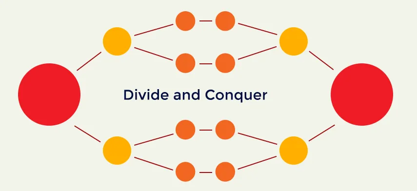

## Introduction
One of the keys to effective critical thinking and problem-solving is the ability to take a large, complex challenge and break it down into smaller, more manageable pieces. When you do this, you can focus your efforts on one aspect of the problem at a time, rather than getting overwhelmed by the entirety of the task. Plus, tackling smaller problems individually can often be more efficient and effective than trying to solve the whole thing at once.

## Tips for Breaking Down Problems
But how do you go about breaking down a big problem? Here are a few tips to get you started:

### Brainstorm
Start by writing down everything that you know about the problem. What are the specific challenges you need to overcome? Are there any dependencies or requirements that you need to consider? This can help you get a better understanding of what you're dealing with and identify potential sub-problems.

### Create a list of sub-problems
Once you have a sense of the different challenges you need to tackle, try organizing them into a list of smaller problems that you can work on independently. This can help you prioritize your efforts and focus on one thing at a time.

### Use visual tools
Tools like flowcharts and mind maps can be helpful for breaking down a problem into smaller pieces. These visual aids can help you see the relationships between different sub-problems and figure out the most logical order in which to tackle them.

### Look for resources
If you get stuck on a particular sub-problem, don't be afraid to seek out resources that can help you. This might mean doing some online research, asking a colleague for advice, or consulting with an expert.

## An Example
Here's an example of how this process might work in practice. Suppose you have an assignment that requires you to query data from a MS SQL database and visualize the results in a couple of charts. Rather than Googling "How to query data from SQL and visualize it using Python," you could break down the assignment requirements into the following sub-problems:

1. Clone down the starting files for the project.
2. Make sure you have all the necessary dependencies and requirements installed.
3. Connect to the database.
4. Run a sample query to test your connection.
5. Store the query results in an appropriate data structure.
6. Visualize the data using the appropriate charts and tools.

By breaking the problem down into smaller pieces, you can focus on solving one sub-problem at a time, rather than trying to tackle the whole thing all at once. And if you get stuck on any particular sub-problem, you can always do some additional research or seek out resources to help you overcome the challenge.

## Conclusion
In conclusion, breaking down big software challenges into smaller, manageable pieces is a key critical thinking skill that can help you solve problems more effectively. So the next time you're facing a big challenge, try breaking it down into smaller pieces and tackling them one by one. You might be surprised by how much more successful you are!

## Bonus: Additional Tips for Breaking Down Problems
* Dividing a problem into smaller tasks that can be tackled independently
* Focusing on one aspect of the problem at a time
* Seeking help and advice from others
* Using tools like flowcharts or mind maps to visualize the problem and its sub-problems