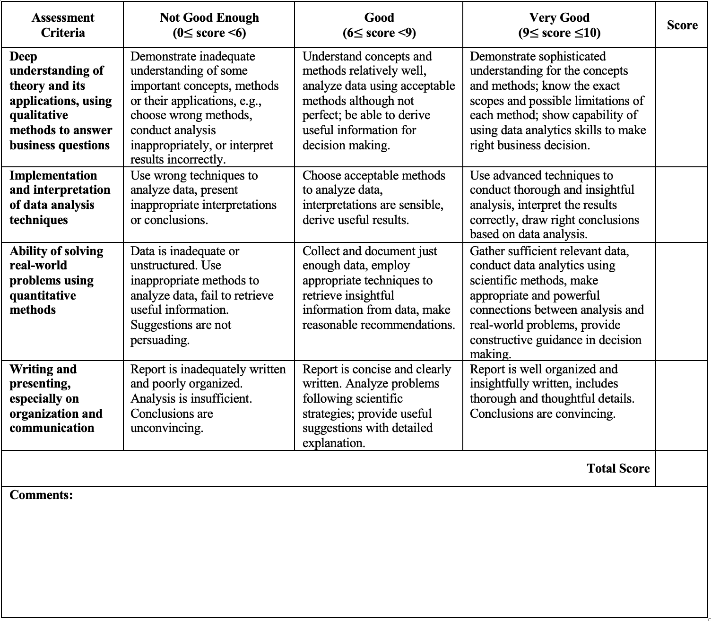
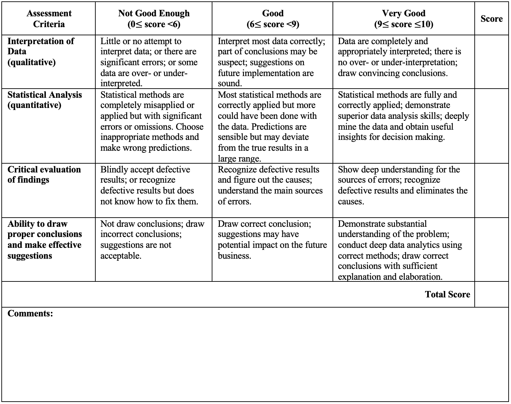

## Learning Objectives
- synthesize everything that was taught in this class. 

## Introduction

## Guidelines
- You're free to choose a project that interest you 
- Connect to multiple data sources (2-3)
- Correlate the data together 
- 6-8 visualizaions
- What's the story?
- Complexity 
  - Not basic aggregations
  - What are the challenges 
   - Dates - customization
  - Custom calculations for a specific thing
   - Create a metric

## Important Deadlines:
  - **Week 5**: *9/25/2022* - Checkpoint 1 is due
  - **Week 6**: *10/2/2022* - Checkpoint 1 Peer Review is due
  - **Week 8**: *10/16/2022* - Checkpoint 2 is due
  - **Week 9**: *10/23/2022* - Checkpoint 2 Peer Review is due
  - **Week 11**: *11/6/2022* - Checkpoint 3 is due
  - **Week 12**: *11/13/2022* - Checkpoint 3 Peer Review is due
  - **Week 14**: *12/4/2022* - Final Project is due
  - **Week 14**: *12/7/2022* - Final Project Peer Review is due

**Let's start 🏁**

## Rubrics

