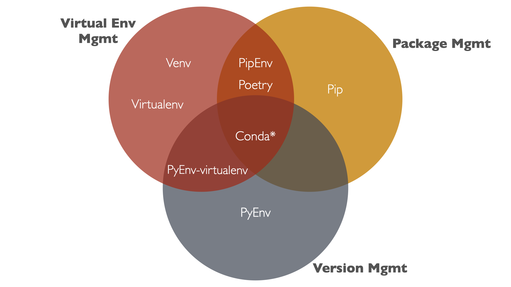

:::info 🦉 Note 
For Instructions on Installing and Setting the different tools, please check out [the installation guide in the course notes](/guides/installation-guides)
:::

* Setting up a data science environment is a daunting task, and it can be daunting to get started.
* Science is about the ability to repeat experiments, and data science and analytics is no different.
* Setting up a data science environment is about having a reproducible environment, and having a reproducible workflow.

### Reproducible Data Science Environment
* Ability to get the same exact dependencies: Package management
* Ability to have multiple project with different dependencies on the same machine: Virtual Environment management
* Ability to have multiple versions on Python on the same machine: Version Management

