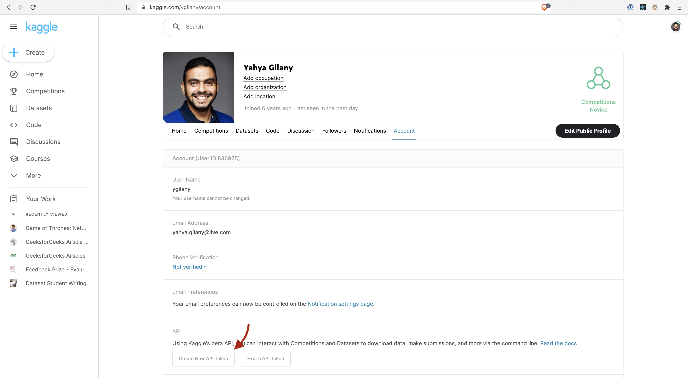
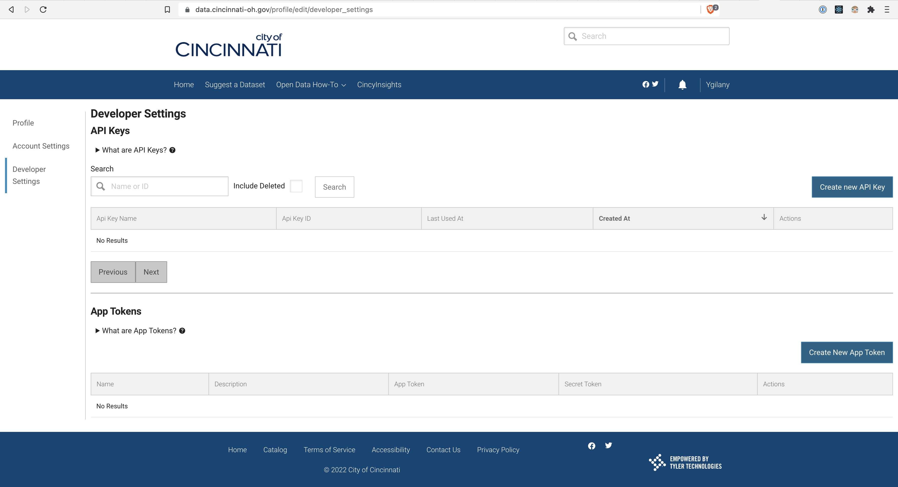
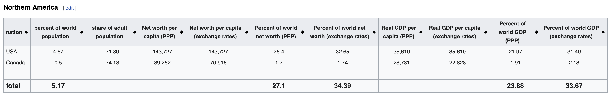
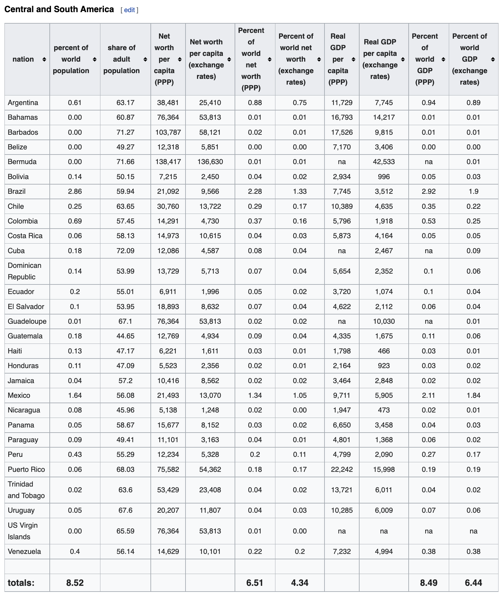
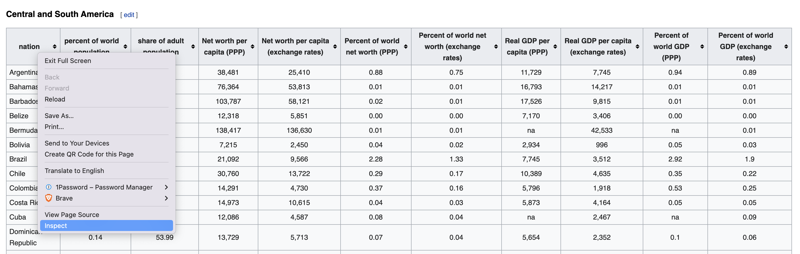
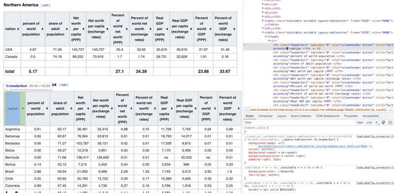
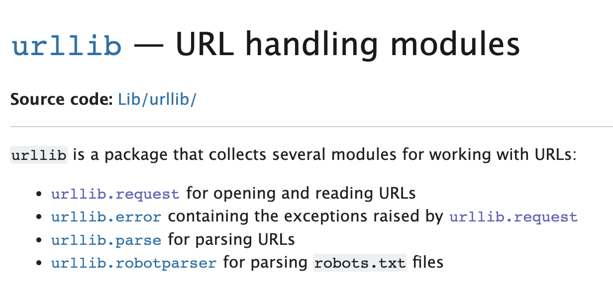

<!-- WARNING: THIS FILE WAS AUTOGENERATED! DO NOT EDIT! Instead, edit the notebook w/the location & name as this file. -->

We can construct a `DataFrame` from a variety of data sources. The most common data sources are:
  * CSV files
  * Excel files
  * SQL databases
  * JSON files
  * HTML files

In this notes, we see some of those examples in action

## 📥 From CSV


```python
import pandas as pd
import numpy as np
```


```python
url = "https://raw.github.com/pandas-dev/pandas/main/pandas/tests/io/data/csv/tips.csv"

tips = pd.read_csv(url)
tips.head()
```
    
<HTMLOutputBlock >


```html
<div>
<style scoped>
    .dataframe tbody tr th:only-of-type {
        vertical-align: middle;
    }

    .dataframe tbody tr th {
        vertical-align: top;
    }

    .dataframe thead th {
        text-align: right;
    }
</style>
<table border="1" class="dataframe">
  <thead>
    <tr style="text-align: right;">
      <th></th>
      <th>total_bill</th>
      <th>tip</th>
      <th>sex</th>
      <th>smoker</th>
      <th>day</th>
      <th>time</th>
      <th>size</th>
    </tr>
  </thead>
  <tbody>
    <tr>
      <th>0</th>
      <td>16.99</td>
      <td>1.01</td>
      <td>Female</td>
      <td>No</td>
      <td>Sun</td>
      <td>Dinner</td>
      <td>2</td>
    </tr>
    <tr>
      <th>1</th>
      <td>10.34</td>
      <td>1.66</td>
      <td>Male</td>
      <td>No</td>
      <td>Sun</td>
      <td>Dinner</td>
      <td>3</td>
    </tr>
    <tr>
      <th>2</th>
      <td>21.01</td>
      <td>3.50</td>
      <td>Male</td>
      <td>No</td>
      <td>Sun</td>
      <td>Dinner</td>
      <td>3</td>
    </tr>
    <tr>
      <th>3</th>
      <td>23.68</td>
      <td>3.31</td>
      <td>Male</td>
      <td>No</td>
      <td>Sun</td>
      <td>Dinner</td>
      <td>2</td>
    </tr>
    <tr>
      <th>4</th>
      <td>24.59</td>
      <td>3.61</td>
      <td>Female</td>
      <td>No</td>
      <td>Sun</td>
      <td>Dinner</td>
      <td>4</td>
    </tr>
  </tbody>
</table>
</div>
```


</HTMLOutputBlock>

The `.head()` function gets you the first 5 elements of the data frame to show what the data would look like.

You could also use the function `describe()` which return summary statistics about the dataset


```python
tips.describe()
```
    
<HTMLOutputBlock >


```html
<div>
<style scoped>
    .dataframe tbody tr th:only-of-type {
        vertical-align: middle;
    }

    .dataframe tbody tr th {
        vertical-align: top;
    }

    .dataframe thead th {
        text-align: right;
    }
</style>
<table border="1" class="dataframe">
  <thead>
    <tr style="text-align: right;">
      <th></th>
      <th>total_bill</th>
      <th>tip</th>
      <th>size</th>
    </tr>
  </thead>
  <tbody>
    <tr>
      <th>count</th>
      <td>244.000000</td>
      <td>244.000000</td>
      <td>244.000000</td>
    </tr>
    <tr>
      <th>mean</th>
      <td>19.785943</td>
      <td>2.998279</td>
      <td>2.569672</td>
    </tr>
    <tr>
      <th>std</th>
      <td>8.902412</td>
      <td>1.383638</td>
      <td>0.951100</td>
    </tr>
    <tr>
      <th>min</th>
      <td>3.070000</td>
      <td>1.000000</td>
      <td>1.000000</td>
    </tr>
    <tr>
      <th>25%</th>
      <td>13.347500</td>
      <td>2.000000</td>
      <td>2.000000</td>
    </tr>
    <tr>
      <th>50%</th>
      <td>17.795000</td>
      <td>2.900000</td>
      <td>2.000000</td>
    </tr>
    <tr>
      <th>75%</th>
      <td>24.127500</td>
      <td>3.562500</td>
      <td>3.000000</td>
    </tr>
    <tr>
      <th>max</th>
      <td>50.810000</td>
      <td>10.000000</td>
      <td>6.000000</td>
    </tr>
  </tbody>
</table>
</div>
```


</HTMLOutputBlock>

### Downloading Dataset from Kaggle using `OpenDatasets`

In cases where you're trying to use datasets that are available on online sources like `Kaggle`. You can continue to use the URL directly, if the source makes one available. Or you could use a tool such as `opendatasets`.
`opendatasets` is a Python library for downloading datasets from online sources like `Kaggle` and `Google Drive` using a simple Python command.

The following examples show how you can (DOWNLOAD) the US Elections Dataset available via `Kaggle`. You will be asked to provide your username and authentication API key (that's not the same as your account password).

**To get your Kaggle API Key:**


this will download a file named `kaggle.json` that contains your account name and a key that you'll use to authenticate in the following code cell.


```python
import opendatasets as od
dataset_url = 'https://www.kaggle.com/tunguz/us-elections-dataset'
od.download(dataset_url, data_dir='./data')
```

<CodeOutputBlock lang="python">

```
    Skipping, found downloaded files in "./data/us-elections-dataset" (use force=True to force download)
```

</CodeOutputBlock>

Once downloaded, you can Import the CSV file into a data frame.


```python
## import CSv file from local folder into a dataframe
elections = pd.read_csv('./data/us-elections-dataset/1976-2020-president.csv')
elections.head()
```
    
<HTMLOutputBlock >


```html
<div>
<style scoped>
    .dataframe tbody tr th:only-of-type {
        vertical-align: middle;
    }

    .dataframe tbody tr th {
        vertical-align: top;
    }

    .dataframe thead th {
        text-align: right;
    }
</style>
<table border="1" class="dataframe">
  <thead>
    <tr style="text-align: right;">
      <th></th>
      <th>year</th>
      <th>state</th>
      <th>state_po</th>
      <th>state_fips</th>
      <th>state_cen</th>
      <th>state_ic</th>
      <th>office</th>
      <th>candidate</th>
      <th>party_detailed</th>
      <th>writein</th>
      <th>candidatevotes</th>
      <th>totalvotes</th>
      <th>version</th>
      <th>notes</th>
      <th>party_simplified</th>
    </tr>
  </thead>
  <tbody>
    <tr>
      <th>0</th>
      <td>1976</td>
      <td>ALABAMA</td>
      <td>AL</td>
      <td>1</td>
      <td>63</td>
      <td>41</td>
      <td>US PRESIDENT</td>
      <td>CARTER, JIMMY</td>
      <td>DEMOCRAT</td>
      <td>False</td>
      <td>659170</td>
      <td>1182850</td>
      <td>20210113</td>
      <td>NaN</td>
      <td>DEMOCRAT</td>
    </tr>
    <tr>
      <th>1</th>
      <td>1976</td>
      <td>ALABAMA</td>
      <td>AL</td>
      <td>1</td>
      <td>63</td>
      <td>41</td>
      <td>US PRESIDENT</td>
      <td>FORD, GERALD</td>
      <td>REPUBLICAN</td>
      <td>False</td>
      <td>504070</td>
      <td>1182850</td>
      <td>20210113</td>
      <td>NaN</td>
      <td>REPUBLICAN</td>
    </tr>
    <tr>
      <th>2</th>
      <td>1976</td>
      <td>ALABAMA</td>
      <td>AL</td>
      <td>1</td>
      <td>63</td>
      <td>41</td>
      <td>US PRESIDENT</td>
      <td>MADDOX, LESTER</td>
      <td>AMERICAN INDEPENDENT PARTY</td>
      <td>False</td>
      <td>9198</td>
      <td>1182850</td>
      <td>20210113</td>
      <td>NaN</td>
      <td>OTHER</td>
    </tr>
    <tr>
      <th>3</th>
      <td>1976</td>
      <td>ALABAMA</td>
      <td>AL</td>
      <td>1</td>
      <td>63</td>
      <td>41</td>
      <td>US PRESIDENT</td>
      <td>BUBAR, BENJAMIN ""BEN""</td>
      <td>PROHIBITION</td>
      <td>False</td>
      <td>6669</td>
      <td>1182850</td>
      <td>20210113</td>
      <td>NaN</td>
      <td>OTHER</td>
    </tr>
    <tr>
      <th>4</th>
      <td>1976</td>
      <td>ALABAMA</td>
      <td>AL</td>
      <td>1</td>
      <td>63</td>
      <td>41</td>
      <td>US PRESIDENT</td>
      <td>HALL, GUS</td>
      <td>COMMUNIST PARTY USE</td>
      <td>False</td>
      <td>1954</td>
      <td>1182850</td>
      <td>20210113</td>
      <td>NaN</td>
      <td>OTHER</td>
    </tr>
  </tbody>
</table>
</div>
```


</HTMLOutputBlock>

## 📥 From API
To import data using an HTTP API in Python, you have multiple options for the HTTP client libraries. The one I choose and use here is `requests`. Here I will show you how you can use `requests` to query data from the US Census Data, and from the John Hopkins COVID APIs.

The most basic example is the following:
```python
import requests

x = requests.get('https://w3schools.com/python/demopage.htm')

print(x.text)
```

However, depending on the API provider, we may need to pass additional configurations and options in the request. We'll see that in the following examples

### US Census Data
The US Census Bureau provides machine-readable dataset via a developer API. 

> Developers could use the statistics available through this API to create apps that:
> 1. Show commuting patterns for every city in America.
> 2. Display the latest numbers on owners and renters in a neighborhood someone may want to live in.
> 3. Provide a local government a range of socioeconomic statistics on its population.

Here are [some of the datasets available that you can use](https://www.census.gov/data/developers/data-sets.html)

Each dataset provides technical documentation for the different variables you could get from that Particular API. Here's [an example](https://api.census.gov/data/2020/dec/pl/variables.html)


- [Working with US Census Data - PDF Guide](https://www.census.gov/content/dam/Census/library/publications/2020/acs/acs_api_handbook_2020_ch02.pdf)

To construct a request with `requests` we need to determine the URL we need to send the request to.


```python
import requests

HOST = "https://api.census.gov/data"
year = "2022"
dataset = "cps/basic/apr"
base_url = "/".join([HOST, year, dataset]) # JOIN the variables with a `/` separator https://api.census.gov/data/2022/cps/basic/apr

# The dataset is huge and contains a lot of data, so we'll request a subset of the available variables.
dataset_variables = ["GEDIV","HRMIS","PENATVTY"] 

predicates = {}
predicates["get"] = ",".join(dataset_variables) # JOIN the variables with a `,` separator
predicates["for"] = "state:*"

response = requests.get(base_url, params=predicates)

census_data = pd.DataFrame.from_records(response.json()[1:], columns=response.json()[0])
print(census_data.head())
```

<CodeOutputBlock lang="python">

```
      GEDIV HRMIS PENATVTY state
    0     8     8      303     4
    1     8     8      303     4
    2     8     8       57     4
    3     8     8       57     4
    4     7     2       57     5
```

</CodeOutputBlock>

This [link here](https://api.census.gov/data/2022/cps/basic/apr/variables.html) describes what those variables mean.

Also, you note that even the states are presented with some numerical values. to get the values of those state IDs, I'll send another request to another dataset


```python
import requests

HOST = "https://api.census.gov/data"
year = "2017"
dataset = "acs/acs5"
base_url = "/".join([HOST, year, dataset]) # JOIN the variables with a `/` separator https://api.census.gov/data/2022/cps/basic/apr

dataset_variables = ["NAME"]
predicates = {}
predicates["get"] = ",".join(dataset_variables)
predicates["for"] = "state:*"

r = requests.get(base_url, params=predicates)
states = pd.DataFrame.from_records(r.json()[1:], columns=r.json()[0])
print(states.head())
```

<CodeOutputBlock lang="python">

```
              NAME state
    0  Mississippi    28
    1     Missouri    29
    2      Montana    30
    3     Nebraska    31
    4       Nevada    32
```

</CodeOutputBlock>

You could subset the data recieved to find the State Numerical Code for the `Ohio`


```python
# Find the state code with the name "Ohio"
print(states[states["NAME"] == "Ohio"])
```

<CodeOutputBlock lang="python">

```
        NAME state
    16  Ohio    39
```

</CodeOutputBlock>

or you could just combine and merge the 2 data sets on the state ID, so we end up with a single dataset with all the information we need.


```python
# Merge census_data and states
full_census_data = pd.merge(census_data, states, on="state")
full_census_data.head() # Print the first 5 rows
```
    
<HTMLOutputBlock >


```html
<div>
<style scoped>
    .dataframe tbody tr th:only-of-type {
        vertical-align: middle;
    }

    .dataframe tbody tr th {
        vertical-align: top;
    }

    .dataframe thead th {
        text-align: right;
    }
</style>
<table border="1" class="dataframe">
  <thead>
    <tr style="text-align: right;">
      <th></th>
      <th>GEDIV</th>
      <th>HRMIS</th>
      <th>PENATVTY</th>
      <th>state</th>
      <th>NAME</th>
    </tr>
  </thead>
  <tbody>
    <tr>
      <th>0</th>
      <td>7</td>
      <td>6</td>
      <td>57</td>
      <td>40</td>
      <td>Oklahoma</td>
    </tr>
    <tr>
      <th>1</th>
      <td>7</td>
      <td>6</td>
      <td>57</td>
      <td>40</td>
      <td>Oklahoma</td>
    </tr>
    <tr>
      <th>2</th>
      <td>7</td>
      <td>6</td>
      <td>57</td>
      <td>40</td>
      <td>Oklahoma</td>
    </tr>
    <tr>
      <th>3</th>
      <td>7</td>
      <td>6</td>
      <td>57</td>
      <td>40</td>
      <td>Oklahoma</td>
    </tr>
    <tr>
      <th>4</th>
      <td>7</td>
      <td>3</td>
      <td>57</td>
      <td>40</td>
      <td>Oklahoma</td>
    </tr>
  </tbody>
</table>
</div>
```


</HTMLOutputBlock>

### John Hopkins Covid API

John Hopkins University | Cornoavirus Resources Center have been collecting and publishing data regarding COVID-19 since day one. 
You can learn more about that and [find official resources for how to use the data here](https://coronavirus.jhu.edu/about/how-to-use-our-data)

I believe someone is publishing those datasets by means of API through the RapidAPI platform. Whether it's an official resource or not, the goal of this exercise is to show you how to work with APIs in general.

You can see a very easy to understand documentation of [how to use the API here](https://rapidapi.com/axisbits-axisbits-default/api/covid-19-statistics/). 


```python
import os
from dotenv import load_dotenv
import requests

load_dotenv(override=True)
rapid_api_key = os.getenv("RAPID_API_KEY")

url = "https://covid-19-statistics.p.rapidapi.com/reports"
querystring = {"region_province":"Ohio","iso":"USA","region_name":"US","q":"US Ohio","date":"2020-04-16"}

headers = {
	"X-RapidAPI-Key": rapid_api_key,
	"X-RapidAPI-Host": "covid-19-statistics.p.rapidapi.com"
}

response = requests.request("GET", url, headers=headers, params=querystring)

# save json result into a pandas dataframe
covid_data = pd.DataFrame(response.json()["data"][0]["region"]["cities"])
covid_data.head()
```
    
<HTMLOutputBlock >


```html
<div>
<style scoped>
    .dataframe tbody tr th:only-of-type {
        vertical-align: middle;
    }

    .dataframe tbody tr th {
        vertical-align: top;
    }

    .dataframe thead th {
        text-align: right;
    }
</style>
<table border="1" class="dataframe">
  <thead>
    <tr style="text-align: right;">
      <th></th>
      <th>name</th>
      <th>date</th>
      <th>fips</th>
      <th>lat</th>
      <th>long</th>
      <th>confirmed</th>
      <th>deaths</th>
      <th>confirmed_diff</th>
      <th>deaths_diff</th>
      <th>last_update</th>
    </tr>
  </thead>
  <tbody>
    <tr>
      <th>0</th>
      <td>Adams</td>
      <td>2020-04-16</td>
      <td>39001</td>
      <td>38.84541072</td>
      <td>-83.4718964</td>
      <td>3</td>
      <td>0</td>
      <td>0</td>
      <td>0</td>
      <td>2020-04-16 23:30:51</td>
    </tr>
    <tr>
      <th>1</th>
      <td>Allen</td>
      <td>2020-04-16</td>
      <td>39003</td>
      <td>40.77285242</td>
      <td>-84.10802343</td>
      <td>57</td>
      <td>6</td>
      <td>6</td>
      <td>2</td>
      <td>2020-04-16 23:30:51</td>
    </tr>
    <tr>
      <th>2</th>
      <td>Ashland</td>
      <td>2020-04-16</td>
      <td>39005</td>
      <td>40.84772277</td>
      <td>-82.27280781</td>
      <td>5</td>
      <td>0</td>
      <td>-1</td>
      <td>0</td>
      <td>2020-04-16 23:30:51</td>
    </tr>
    <tr>
      <th>3</th>
      <td>Ashtabula</td>
      <td>2020-04-16</td>
      <td>39007</td>
      <td>41.70860332</td>
      <td>-80.74830218</td>
      <td>45</td>
      <td>3</td>
      <td>9</td>
      <td>0</td>
      <td>2020-04-16 23:30:51</td>
    </tr>
    <tr>
      <th>4</th>
      <td>Athens</td>
      <td>2020-04-16</td>
      <td>39009</td>
      <td>39.33425634</td>
      <td>-82.04278644</td>
      <td>3</td>
      <td>1</td>
      <td>0</td>
      <td>0</td>
      <td>2020-04-16 23:30:51</td>
    </tr>
  </tbody>
</table>
</div>
```


</HTMLOutputBlock>

## 📥 Using Socrata
The Socrata Open Data API allows you to programmatically access a wealth of open data resources from governments, non-profits, and NGOs around the world. 

### Cincinnati Datasets
For example, [here are a bunch of datasets that you can find about the City of Cincinnati](https://www.opendatanetwork.com/entity/1600000US3915000/Cincinnati_OH/demographics.population.count?ref=search-entity&year=2018)

For you to be able to access any of those datasets, you need to register to get an application token.




```python
import os
from dotenv import load_dotenv
import pandas as pd
from sodapy import Socrata

load_dotenv(override=True)

# Example authenticated client (needed for non-public datasets):
app_token = os.getenv("SODA_APP_TOKEN")

# client = Socrata("data.cincinnati-oh.gov", None)
client = Socrata("data.cincinnati-oh.gov",app_token)


# First 2000 results, returned as JSON from API / converted to Python list of
# dictionaries by sodapy.
results = client.get("rvmt-pkmq", limit=2000)

# Convert to pandas DataFrame
results_df = pd.DataFrame.from_records(results)
print(results_df.columns)
```

<CodeOutputBlock lang="python">

```
    Index(['address_x', 'latitude_x', 'longitude_x', 'age',
           'community_council_neighborhood', 'cpd_neighborhood',
           'sna_neighborhood', 'crashdate', 'crashseverity', 'crashseverityid',
           'datecrashreported', 'dayofweek', 'gender', 'injuries', 'instanceid',
           'lightconditionsprimary', 'localreportno', 'mannerofcrash',
           'roadconditionsprimary', 'roadcontour', 'roadsurface', 'unittype',
           'typeofperson', 'weather', 'zip', 'roadclass', 'roadclassdesc'],
          dtype='object')
```

</CodeOutputBlock>

## 📥 From SQL

### About SQL
SQL is a powerful programming language that allows us to interact and save data in Relational Databases. SQL stores data in a table format, consisting of rows representing a number of records and columns corresponding to various features.

There are many categories categories of SQL commands:
1. Data Definition Language (DDL)
   1. `CREATE`, `ALTER`, `DROP`; these are the commands used to define the data structure or the data model.

2. Data Manipulation Language (DML)
   1. `INSERT`, `UPDATE`, `DELETE`; these are the commands used to modify data in existing databases.

3. Data Query Language (DQL)
   1. `SELECT`

4. Data Control Langauge (DCL)
   1. `GRANT`, `REVOKE`; administrative commands to manage user permissions and access

5. Transaction Control Language (TCL)
   1. `COMMIT`, `ROLLBACK`, `BEGIN TRANSACTION`; for managing transaction queries where multiple DML are processed in a single operation. This is more for software developers than it is for data analysts.

While there is a SQL Standard, there are many dialects and implementations of that standard. You'll often hear of `Microsoft SQL Server`, `MySQL`, `PostgreSQL`, ...etc. All of these require that the an instance of the server is hosted on some server or locally.

Another dialect of SQL is called `SQLite`. This is a small, self-contained, serverless relational database system. This means that the entire database would be contained in a file. that can be shared with others. This has pros and cons.

For the purposes of demo-ing how we can use Python to interact with SQL Database, I'm using a sample SQLite database. The [SQLite Tutorial Website](https://www.sqlitetutorial.net/sqlite-sample-database/) offers same sample database for testing and training. 

I'm here demo-ing using the Chinook database in python. This is the database schema for the database tables.


First off, I'll download the sqlite database from [https://www.sqlitetutorial.net/wp-content/uploads/2018/03/chinook.zip](https://www.sqlitetutorial.net/wp-content/uploads/2018/03/chinook.zip). The downloaded file is zipped so I will need to also unzip that file. (of course we can do that manually, but how savage is that)


```python
from zipfile import ZipFile
from urllib.request import urlretrieve

file_handle, _ = urlretrieve("https://www.sqlitetutorial.net/wp-content/uploads/2018/03/chinook.zip")
zipfile = ZipFile(file_handle, 'r')
zipfile.extractall(".")
zipfile.close()
```

We'll need to use the `SQLAlchemy` package from the Python Package Index.

Here we define the connection string a sqlite connection to a locally available SQLite Database file `chinook`


```python
from sqlalchemy import create_engine

connection_string = "sqlite:///chinook.db"
engine = create_engine(connection_string)

dbConnection = engine.connect()
```


```python
import pandas as pd

genres_df = pd.read_sql("SELECT * FROM genres;", dbConnection)
genres_df
```
    
<HTMLOutputBlock >


```html
<div>
<style scoped>
    .dataframe tbody tr th:only-of-type {
        vertical-align: middle;
    }

    .dataframe tbody tr th {
        vertical-align: top;
    }

    .dataframe thead th {
        text-align: right;
    }
</style>
<table border="1" class="dataframe">
  <thead>
    <tr style="text-align: right;">
      <th></th>
      <th>GenreId</th>
      <th>Name</th>
    </tr>
  </thead>
  <tbody>
    <tr>
      <th>0</th>
      <td>1</td>
      <td>Rock</td>
    </tr>
    <tr>
      <th>1</th>
      <td>2</td>
      <td>Jazz</td>
    </tr>
    <tr>
      <th>2</th>
      <td>3</td>
      <td>Metal</td>
    </tr>
    <tr>
      <th>3</th>
      <td>4</td>
      <td>Alternative &amp; Punk</td>
    </tr>
    <tr>
      <th>4</th>
      <td>5</td>
      <td>Rock And Roll</td>
    </tr>
    <tr>
      <th>5</th>
      <td>6</td>
      <td>Blues</td>
    </tr>
    <tr>
      <th>6</th>
      <td>7</td>
      <td>Latin</td>
    </tr>
    <tr>
      <th>7</th>
      <td>8</td>
      <td>Reggae</td>
    </tr>
    <tr>
      <th>8</th>
      <td>9</td>
      <td>Pop</td>
    </tr>
    <tr>
      <th>9</th>
      <td>10</td>
      <td>Soundtrack</td>
    </tr>
    <tr>
      <th>10</th>
      <td>11</td>
      <td>Bossa Nova</td>
    </tr>
    <tr>
      <th>11</th>
      <td>12</td>
      <td>Easy Listening</td>
    </tr>
    <tr>
      <th>12</th>
      <td>13</td>
      <td>Heavy Metal</td>
    </tr>
    <tr>
      <th>13</th>
      <td>14</td>
      <td>R&amp;B/Soul</td>
    </tr>
    <tr>
      <th>14</th>
      <td>15</td>
      <td>Electronica/Dance</td>
    </tr>
    <tr>
      <th>15</th>
      <td>16</td>
      <td>World</td>
    </tr>
    <tr>
      <th>16</th>
      <td>17</td>
      <td>Hip Hop/Rap</td>
    </tr>
    <tr>
      <th>17</th>
      <td>18</td>
      <td>Science Fiction</td>
    </tr>
    <tr>
      <th>18</th>
      <td>19</td>
      <td>TV Shows</td>
    </tr>
    <tr>
      <th>19</th>
      <td>20</td>
      <td>Sci Fi &amp; Fantasy</td>
    </tr>
    <tr>
      <th>20</th>
      <td>21</td>
      <td>Drama</td>
    </tr>
    <tr>
      <th>21</th>
      <td>22</td>
      <td>Comedy</td>
    </tr>
    <tr>
      <th>22</th>
      <td>23</td>
      <td>Alternative</td>
    </tr>
    <tr>
      <th>23</th>
      <td>24</td>
      <td>Classical</td>
    </tr>
    <tr>
      <th>24</th>
      <td>25</td>
      <td>Opera</td>
    </tr>
  </tbody>
</table>
</div>
```


</HTMLOutputBlock>

Let's add one item to the dataframe


```python
genres_df = pd.concat([genres_df, pd.DataFrame.from_records([{'GenreId': '26', 'Name': 'Arabic Pop'}])], ignore_index=True)
genres_df
```
    
<HTMLOutputBlock >


```html
<div>
<style scoped>
    .dataframe tbody tr th:only-of-type {
        vertical-align: middle;
    }

    .dataframe tbody tr th {
        vertical-align: top;
    }

    .dataframe thead th {
        text-align: right;
    }
</style>
<table border="1" class="dataframe">
  <thead>
    <tr style="text-align: right;">
      <th></th>
      <th>GenreId</th>
      <th>Name</th>
    </tr>
  </thead>
  <tbody>
    <tr>
      <th>0</th>
      <td>1</td>
      <td>Rock</td>
    </tr>
    <tr>
      <th>1</th>
      <td>2</td>
      <td>Jazz</td>
    </tr>
    <tr>
      <th>2</th>
      <td>3</td>
      <td>Metal</td>
    </tr>
    <tr>
      <th>3</th>
      <td>4</td>
      <td>Alternative &amp; Punk</td>
    </tr>
    <tr>
      <th>4</th>
      <td>5</td>
      <td>Rock And Roll</td>
    </tr>
    <tr>
      <th>5</th>
      <td>6</td>
      <td>Blues</td>
    </tr>
    <tr>
      <th>6</th>
      <td>7</td>
      <td>Latin</td>
    </tr>
    <tr>
      <th>7</th>
      <td>8</td>
      <td>Reggae</td>
    </tr>
    <tr>
      <th>8</th>
      <td>9</td>
      <td>Pop</td>
    </tr>
    <tr>
      <th>9</th>
      <td>10</td>
      <td>Soundtrack</td>
    </tr>
    <tr>
      <th>10</th>
      <td>11</td>
      <td>Bossa Nova</td>
    </tr>
    <tr>
      <th>11</th>
      <td>12</td>
      <td>Easy Listening</td>
    </tr>
    <tr>
      <th>12</th>
      <td>13</td>
      <td>Heavy Metal</td>
    </tr>
    <tr>
      <th>13</th>
      <td>14</td>
      <td>R&amp;B/Soul</td>
    </tr>
    <tr>
      <th>14</th>
      <td>15</td>
      <td>Electronica/Dance</td>
    </tr>
    <tr>
      <th>15</th>
      <td>16</td>
      <td>World</td>
    </tr>
    <tr>
      <th>16</th>
      <td>17</td>
      <td>Hip Hop/Rap</td>
    </tr>
    <tr>
      <th>17</th>
      <td>18</td>
      <td>Science Fiction</td>
    </tr>
    <tr>
      <th>18</th>
      <td>19</td>
      <td>TV Shows</td>
    </tr>
    <tr>
      <th>19</th>
      <td>20</td>
      <td>Sci Fi &amp; Fantasy</td>
    </tr>
    <tr>
      <th>20</th>
      <td>21</td>
      <td>Drama</td>
    </tr>
    <tr>
      <th>21</th>
      <td>22</td>
      <td>Comedy</td>
    </tr>
    <tr>
      <th>22</th>
      <td>23</td>
      <td>Alternative</td>
    </tr>
    <tr>
      <th>23</th>
      <td>24</td>
      <td>Classical</td>
    </tr>
    <tr>
      <th>24</th>
      <td>25</td>
      <td>Opera</td>
    </tr>
    <tr>
      <th>25</th>
      <td>26</td>
      <td>Arabic Pop</td>
    </tr>
  </tbody>
</table>
</div>
```


</HTMLOutputBlock>

Let's update the database with the new data


```python
genres_df.to_sql('genres', dbConnection, if_exists='replace', index=False)
```

<CodeOutputBlock lang="python">

```
    26
```

</CodeOutputBlock>

Let's see what's in the database table now


```python
df2 = pd.read_sql("SELECT * FROM genres;", dbConnection)
df2
```
    
<HTMLOutputBlock >


```html
<div>
<style scoped>
    .dataframe tbody tr th:only-of-type {
        vertical-align: middle;
    }

    .dataframe tbody tr th {
        vertical-align: top;
    }

    .dataframe thead th {
        text-align: right;
    }
</style>
<table border="1" class="dataframe">
  <thead>
    <tr style="text-align: right;">
      <th></th>
      <th>GenreId</th>
      <th>Name</th>
    </tr>
  </thead>
  <tbody>
    <tr>
      <th>0</th>
      <td>1</td>
      <td>Rock</td>
    </tr>
    <tr>
      <th>1</th>
      <td>2</td>
      <td>Jazz</td>
    </tr>
    <tr>
      <th>2</th>
      <td>3</td>
      <td>Metal</td>
    </tr>
    <tr>
      <th>3</th>
      <td>4</td>
      <td>Alternative &amp; Punk</td>
    </tr>
    <tr>
      <th>4</th>
      <td>5</td>
      <td>Rock And Roll</td>
    </tr>
    <tr>
      <th>5</th>
      <td>6</td>
      <td>Blues</td>
    </tr>
    <tr>
      <th>6</th>
      <td>7</td>
      <td>Latin</td>
    </tr>
    <tr>
      <th>7</th>
      <td>8</td>
      <td>Reggae</td>
    </tr>
    <tr>
      <th>8</th>
      <td>9</td>
      <td>Pop</td>
    </tr>
    <tr>
      <th>9</th>
      <td>10</td>
      <td>Soundtrack</td>
    </tr>
    <tr>
      <th>10</th>
      <td>11</td>
      <td>Bossa Nova</td>
    </tr>
    <tr>
      <th>11</th>
      <td>12</td>
      <td>Easy Listening</td>
    </tr>
    <tr>
      <th>12</th>
      <td>13</td>
      <td>Heavy Metal</td>
    </tr>
    <tr>
      <th>13</th>
      <td>14</td>
      <td>R&amp;B/Soul</td>
    </tr>
    <tr>
      <th>14</th>
      <td>15</td>
      <td>Electronica/Dance</td>
    </tr>
    <tr>
      <th>15</th>
      <td>16</td>
      <td>World</td>
    </tr>
    <tr>
      <th>16</th>
      <td>17</td>
      <td>Hip Hop/Rap</td>
    </tr>
    <tr>
      <th>17</th>
      <td>18</td>
      <td>Science Fiction</td>
    </tr>
    <tr>
      <th>18</th>
      <td>19</td>
      <td>TV Shows</td>
    </tr>
    <tr>
      <th>19</th>
      <td>20</td>
      <td>Sci Fi &amp; Fantasy</td>
    </tr>
    <tr>
      <th>20</th>
      <td>21</td>
      <td>Drama</td>
    </tr>
    <tr>
      <th>21</th>
      <td>22</td>
      <td>Comedy</td>
    </tr>
    <tr>
      <th>22</th>
      <td>23</td>
      <td>Alternative</td>
    </tr>
    <tr>
      <th>23</th>
      <td>24</td>
      <td>Classical</td>
    </tr>
    <tr>
      <th>24</th>
      <td>25</td>
      <td>Opera</td>
    </tr>
    <tr>
      <th>25</th>
      <td>26</td>
      <td>Arabic Pop</td>
    </tr>
  </tbody>
</table>
</div>
```


</HTMLOutputBlock>

## 📥 From MongoDB

If you've taken Contemporary Database, you have already learned about One of the NoSQL Database options, MongoDB.

In the following example, I will show you how you can use Python to Query Data from a MongoDB.

Here we'll need to install the `PyMongo` Package. Depending on the MongoDB instance you're trying to connect to, you will need an extra companion package. You can find out about that in this [link to the PyMongo Documentation](https://pymongo.readthedocs.io/en/stable/installation.html). For instances:
* For AWS, you need to install `pymongo[aws]`
* For `mongodb+srv` connection strings, you'd need to install `pymongo[srv]`

For the MongoDB instance on Mongo Atlas, we need `pymongo[srv]`, `pipenv install 'pymongo[srv]'`


```python
import pandas as pd
from pymongo import MongoClient
import os
from dotenv import load_dotenv

load_dotenv(override=True)

pd.set_option('display.max_columns', None) # Otherwise, pandas would not be able to display the full content of each cell


def _connect_mongo(host, username, password, db):
    """ A util for making a connection to mongo """

    mongo_uri = 'mongodb+srv://%s:%s@%s/?retryWrites=true&w=majority"' % (username, password, host)

    conn = MongoClient(mongo_uri)

    return conn[db]


def read_mongo(db, collection, query={}, no_id=True):
    """ Read from Mongo and Store into DataFrame """

    # Make a query to the specific DB and Collection
    cursor = db[collection].find(query)

    # Expand the cursor and construct the DataFrame
    df =  pd.DataFrame(list(cursor))

    # Delete the _id
    if no_id:
        del df['_id']

    return df

username = os.getenv("MONGO_USERNAME")
password = os.getenv("MONGO_PASSWORD")

db = _connect_mongo(host='it4063c.ykv1yjn.mongodb.net', username=username, password=password, db='sample_airbnb')
df = read_mongo(db=db, collection='listingsAndReviews', query={'bedrooms': {'$lt': 2}}, no_id=False)
df.head()
```
    
<HTMLOutputBlock >


```html
<div>
<style scoped>
    .dataframe tbody tr th:only-of-type {
        vertical-align: middle;
    }

    .dataframe tbody tr th {
        vertical-align: top;
    }

    .dataframe thead th {
        text-align: right;
    }
</style>
<table border="1" class="dataframe">
  <thead>
    <tr style="text-align: right;">
      <th></th>
      <th>_id</th>
      <th>listing_url</th>
      <th>name</th>
      <th>summary</th>
      <th>space</th>
      <th>description</th>
      <th>neighborhood_overview</th>
      <th>notes</th>
      <th>transit</th>
      <th>access</th>
      <th>interaction</th>
      <th>house_rules</th>
      <th>property_type</th>
      <th>room_type</th>
      <th>bed_type</th>
      <th>minimum_nights</th>
      <th>maximum_nights</th>
      <th>cancellation_policy</th>
      <th>last_scraped</th>
      <th>calendar_last_scraped</th>
      <th>accommodates</th>
      <th>bedrooms</th>
      <th>beds</th>
      <th>number_of_reviews</th>
      <th>bathrooms</th>
      <th>amenities</th>
      <th>price</th>
      <th>weekly_price</th>
      <th>monthly_price</th>
      <th>cleaning_fee</th>
      <th>extra_people</th>
      <th>guests_included</th>
      <th>images</th>
      <th>host</th>
      <th>address</th>
      <th>availability</th>
      <th>review_scores</th>
      <th>reviews</th>
      <th>first_review</th>
      <th>last_review</th>
      <th>security_deposit</th>
      <th>reviews_per_month</th>
    </tr>
  </thead>
  <tbody>
    <tr>
      <th>0</th>
      <td>10009999</td>
      <td>https://www.airbnb.com/rooms/10009999</td>
      <td>Horto flat with small garden</td>
      <td>One bedroom + sofa-bed in quiet and bucolic ne...</td>
      <td>Lovely one bedroom + sofa-bed in the living ro...</td>
      <td>One bedroom + sofa-bed in quiet and bucolic ne...</td>
      <td>This charming ground floor flat is located in ...</td>
      <td>There´s a table in the living room now, that d...</td>
      <td>Easy access to transport (bus, taxi, car) and ...</td>
      <td></td>
      <td>I´ll be happy to help you with any doubts, tip...</td>
      <td>I just hope the guests treat the space as they...</td>
      <td>Apartment</td>
      <td>Entire home/apt</td>
      <td>Real Bed</td>
      <td>2</td>
      <td>1125</td>
      <td>flexible</td>
      <td>2019-02-11 05:00:00</td>
      <td>2019-02-11 05:00:00</td>
      <td>4</td>
      <td>1</td>
      <td>2.0</td>
      <td>0</td>
      <td>1.0</td>
      <td>[Wifi, Wheelchair accessible, Kitchen, Free pa...</td>
      <td>317.00</td>
      <td>1492.00</td>
      <td>4849.00</td>
      <td>187.00</td>
      <td>0.00</td>
      <td>1</td>
      <td>{'thumbnail_url': '', 'medium_url': '', 'pictu...</td>
      <td>{'host_id': '1282196', 'host_url': 'https://ww...</td>
      <td>{'street': 'Rio de Janeiro, Rio de Janeiro, Br...</td>
      <td>{'availability_30': 0, 'availability_60': 0, '...</td>
      <td>{}</td>
      <td>[]</td>
      <td>NaT</td>
      <td>NaT</td>
      <td>NaN</td>
      <td>NaN</td>
    </tr>
    <tr>
      <th>1</th>
      <td>1001265</td>
      <td>https://www.airbnb.com/rooms/1001265</td>
      <td>Ocean View Waikiki Marina w/prkg</td>
      <td>A short distance from Honolulu's billion dolla...</td>
      <td>Great studio located on Ala Moana across the s...</td>
      <td>A short distance from Honolulu's billion dolla...</td>
      <td>You can breath ocean as well as aloha.</td>
      <td></td>
      <td>Honolulu does have a very good air conditioned...</td>
      <td>Pool, hot tub and tennis</td>
      <td>We try our best at creating, simple responsive...</td>
      <td>The general welfare and well being of all the ...</td>
      <td>Condominium</td>
      <td>Entire home/apt</td>
      <td>Real Bed</td>
      <td>3</td>
      <td>365</td>
      <td>strict_14_with_grace_period</td>
      <td>2019-03-06 05:00:00</td>
      <td>2019-03-06 05:00:00</td>
      <td>2</td>
      <td>1</td>
      <td>1.0</td>
      <td>96</td>
      <td>1.0</td>
      <td>[TV, Cable TV, Wifi, Air conditioning, Pool, K...</td>
      <td>115.00</td>
      <td>650.00</td>
      <td>2150.00</td>
      <td>100.00</td>
      <td>0.00</td>
      <td>1</td>
      <td>{'thumbnail_url': '', 'medium_url': '', 'pictu...</td>
      <td>{'host_id': '5448114', 'host_url': 'https://ww...</td>
      <td>{'street': 'Honolulu, HI, United States', 'sub...</td>
      <td>{'availability_30': 16, 'availability_60': 46,...</td>
      <td>{'review_scores_accuracy': 9, 'review_scores_c...</td>
      <td>[{'_id': '4765259', 'date': 2013-05-24 04:00:0...</td>
      <td>2013-05-24 04:00:00</td>
      <td>2019-02-07 05:00:00</td>
      <td>NaN</td>
      <td>NaN</td>
    </tr>
    <tr>
      <th>2</th>
      <td>10021707</td>
      <td>https://www.airbnb.com/rooms/10021707</td>
      <td>Private Room in Bushwick</td>
      <td>Here exists a very cozy room for rent in a sha...</td>
      <td></td>
      <td>Here exists a very cozy room for rent in a sha...</td>
      <td></td>
      <td></td>
      <td></td>
      <td></td>
      <td></td>
      <td></td>
      <td>Apartment</td>
      <td>Private room</td>
      <td>Real Bed</td>
      <td>14</td>
      <td>1125</td>
      <td>flexible</td>
      <td>2019-03-06 05:00:00</td>
      <td>2019-03-06 05:00:00</td>
      <td>1</td>
      <td>1</td>
      <td>1.0</td>
      <td>1</td>
      <td>1.5</td>
      <td>[Internet, Wifi, Air conditioning, Kitchen, Bu...</td>
      <td>40.00</td>
      <td>NaN</td>
      <td>NaN</td>
      <td>NaN</td>
      <td>0.00</td>
      <td>1</td>
      <td>{'thumbnail_url': '', 'medium_url': '', 'pictu...</td>
      <td>{'host_id': '11275734', 'host_url': 'https://w...</td>
      <td>{'street': 'Brooklyn, NY, United States', 'sub...</td>
      <td>{'availability_30': 0, 'availability_60': 0, '...</td>
      <td>{'review_scores_accuracy': 10, 'review_scores_...</td>
      <td>[{'_id': '61050713', 'date': 2016-01-31 05:00:...</td>
      <td>2016-01-31 05:00:00</td>
      <td>2016-01-31 05:00:00</td>
      <td>NaN</td>
      <td>NaN</td>
    </tr>
    <tr>
      <th>3</th>
      <td>10030955</td>
      <td>https://www.airbnb.com/rooms/10030955</td>
      <td>Apt Linda Vista Lagoa - Rio</td>
      <td>Quarto com vista para a Lagoa Rodrigo de Freit...</td>
      <td></td>
      <td>Quarto com vista para a Lagoa Rodrigo de Freit...</td>
      <td></td>
      <td></td>
      <td></td>
      <td></td>
      <td></td>
      <td></td>
      <td>Apartment</td>
      <td>Private room</td>
      <td>Real Bed</td>
      <td>1</td>
      <td>1125</td>
      <td>flexible</td>
      <td>2019-02-11 05:00:00</td>
      <td>2019-02-11 05:00:00</td>
      <td>2</td>
      <td>1</td>
      <td>1.0</td>
      <td>0</td>
      <td>2.0</td>
      <td>[TV, Cable TV, Internet, Wifi, Air conditionin...</td>
      <td>701.00</td>
      <td>NaN</td>
      <td>NaN</td>
      <td>250.00</td>
      <td>0.00</td>
      <td>1</td>
      <td>{'thumbnail_url': '', 'medium_url': '', 'pictu...</td>
      <td>{'host_id': '51496939', 'host_url': 'https://w...</td>
      <td>{'street': 'Rio de Janeiro, Rio de Janeiro, Br...</td>
      <td>{'availability_30': 28, 'availability_60': 58,...</td>
      <td>{}</td>
      <td>[]</td>
      <td>NaT</td>
      <td>NaT</td>
      <td>1000.00</td>
      <td>NaN</td>
    </tr>
    <tr>
      <th>4</th>
      <td>1003530</td>
      <td>https://www.airbnb.com/rooms/1003530</td>
      <td>New York City - Upper West Side Apt</td>
      <td></td>
      <td>Murphy bed, optional second bedroom available....</td>
      <td>Murphy bed, optional second bedroom available....</td>
      <td>Great neighborhood - many terrific restaurants...</td>
      <td>My cat, Samantha, are in and out during the su...</td>
      <td>Conveniently located near 1, 2, 3, B &amp; C subwa...</td>
      <td>New York City!</td>
      <td></td>
      <td>No smoking is permitted in the apartment. All ...</td>
      <td>Apartment</td>
      <td>Private room</td>
      <td>Real Bed</td>
      <td>12</td>
      <td>360</td>
      <td>strict_14_with_grace_period</td>
      <td>2019-03-07 05:00:00</td>
      <td>2019-03-07 05:00:00</td>
      <td>2</td>
      <td>1</td>
      <td>1.0</td>
      <td>70</td>
      <td>1.0</td>
      <td>[Internet, Wifi, Air conditioning, Kitchen, El...</td>
      <td>135.00</td>
      <td>NaN</td>
      <td>NaN</td>
      <td>135.00</td>
      <td>0.00</td>
      <td>1</td>
      <td>{'thumbnail_url': '', 'medium_url': '', 'pictu...</td>
      <td>{'host_id': '454250', 'host_url': 'https://www...</td>
      <td>{'street': 'New York, NY, United States', 'sub...</td>
      <td>{'availability_30': 0, 'availability_60': 0, '...</td>
      <td>{'review_scores_accuracy': 10, 'review_scores_...</td>
      <td>[{'_id': '4351675', 'date': 2013-04-29 04:00:0...</td>
      <td>2013-04-29 04:00:00</td>
      <td>2018-08-12 04:00:00</td>
      <td>0.00</td>
      <td>NaN</td>
    </tr>
  </tbody>
</table>
</div>
```


</HTMLOutputBlock>

## 📥 Via Web Scrapping

Data is available in different structures and format. These formats are: 
1. Structured Data
  Data that can be displayed in tabular formats. Often the format you find via Databases, CSV files, and sometimes APIs.
2. Unstructured Data
  These are data that can't readily be presented as tables. It may include images, audio files, documents.
3. Semi-Structured Data
  These are structured data that can't exactly fit in a tabular formats. For example, data that's represented as nested objects. (See the COVID API Response; the top level represents all the aggregates, then region specific data, county, city, ...etc. Each of those levels don't necessary contain the same data elements, and may include different features or properties. These are data that are often shared as APIs, JSON files, ...etc.

One of the semi-structured-to unstructured data is data that's available on websites. They're not exactly always in a consumable state (even if they're tables). One way we can take advantage of this information is by Web Scrapping.

This is the process of extracting data from websites.

Let's say we found this data on Wikipedia on [the world distribution of wealth](https://en.wikipedia.org/wiki/Wealth_distribution_by_country). The page contains this information in tables with no API or an easily downloadable CSV files. 




and so on for every continent.

#### Sidebar: HTML Tables
If you're not familiar with HTML as a markup language. Please review [the following website](https://htmlcheatsheet.com/). For this particular part, we're only looking at the Table Markups.

  ```html
  <table>
    <thead>
      <tr>
        <th>Header cell 1</th>
        <th>Header cell 2</th>
      </tr>
    </thead>

    <tbody>
      <tr>
        <td>Row 1 - Cell 1</td>
        <td>Row 1 - Cell 2</td>
      </tr>
      <tr>
        <td>Row 2 - Cell 1</td>
        <td>Row 2 - Cell 2</td>
      </tr>
    </tbody>
  </table>
  ```

If you look at the Wikipedia page, above, you'll see there are multiple sections and html elements on the page. You'll also see multiple tables on the page. The browser receives the data as HTML code, and parses it to present it in a human-friendly format. To see the underlying HTML code, you can open the page inspector/developer tools.

> For any chromium-based browser (Chrome, Firefox, Brave, Edge, ...), you should be able to see the same option.

See how you can see the code elements and what they represent on the web page. 


Now we need to see if we can get the HTML code from this page to parse and extract the data from it. So we'll download the content of the URL as a string first.

We'll use the [`URLLib` Package](https://docs.python.org/3/library/urllib.html). This Package contains multiple modules. The one we're interested in here is the `Request` module, which contains multiple functions related to opening and reading URLs.



Please take a moment to review the [documentation page](https://docs.python.org/3/library/urllib.request.html), especially the [Examples section](https://docs.python.org/3/library/urllib.request.html#examples). You'll need to be familiar with how you can review and understand documentations.

:::info 🦉 Develop that skill
Understanding the documentation is not going to be outdated, The libraries will. These tools will keep on getting updates. Don't memorize the syntax for those libraries but learn how to understand their documentation. That's the skill that you should learn from this lesson.
:::


```python
import urllib.request
```


```python
html = urllib.request.urlopen("https://en.wikipedia.org/wiki/Wealth_distribution_by_country").read(500) # Read the first 500 characters
html
```

<CodeOutputBlock lang="python">

```
    b'<!DOCTYPE html>\n<html class="client-nojs" lang="en" dir="ltr">\n<head>\n<meta charset="UTF-8"/>\n<title>Wealth distribution by country - Wikipedia</title>\n<script>document.documentElement.className="client-js";RLCONF={"wgBreakFrames":false,"wgSeparatorTransformTable":["",""],"wgDigitTransformTable":["",""],"wgDefaultDateFormat":"dmy","wgMonthNames":["","January","February","March","April","May","June","July","August","September","October","November","December"],"wgRequestId":"7a4f1b56-2331-4b09-82b'
```

</CodeOutputBlock>

you can run the previous cell again without passing any numbers in the read function. This will return the entirety of the page. the problem there now is that we have to figure out ways to parse HTML string we receive to find the different elements of the page we're interested in. (not a very easy thing to do)

For a moment, I thought the `parse` module of the same package would be the answer here, however this module parses the URL itself.

Thankfully, some developer ran into the same problem. They developed and release [`BeautifulSoup`](https://www.crummy.com/software/BeautifulSoup/)

This is a python package that's built for HTML web scrapping, it's able to parse and interface with HTML documents.

It's a third party package, so I will need to install it first `pipenv install beautifulsoup4`

Let's now get the wikipedia page using `BeautifulSoup`:


```python
from bs4 import BeautifulSoup
import requests

url = "https://en.wikipedia.org/wiki/Wealth_distribution_by_country"
page = requests.get(url) # Get the page
soup = BeautifulSoup(page.content, 'html.parser') # Parse the HTML as a string
print(soup.prettify()) # Print the parsed data of html
```


```python
tables = soup.find_all('table')

# Get the first table
df = pd.read_html(str(tables[0]))[0]
df
```
    
<HTMLOutputBlock >


```html
<div>
<style scoped>
    .dataframe tbody tr th:only-of-type {
        vertical-align: middle;
    }

    .dataframe tbody tr th {
        vertical-align: top;
    }

    .dataframe thead th {
        text-align: right;
    }
</style>
<table border="1" class="dataframe">
  <thead>
    <tr style="text-align: right;">
      <th></th>
      <th>nation</th>
      <th>percent of world population</th>
      <th>share of adult population</th>
      <th>Net worth per capita (PPP)</th>
      <th>Net worth per capita (exchange rates)</th>
      <th>Percent of world net worth (PPP)</th>
      <th>Percent of world net worth (exchange rates)</th>
      <th>Real GDP per capita (PPP)</th>
      <th>Real GDP per capita (exchange rates)</th>
      <th>Percent of world GDP (PPP)</th>
      <th>Percent of world GDP (exchange rates)</th>
    </tr>
  </thead>
  <tbody>
    <tr>
      <th>0</th>
      <td>USA</td>
      <td>4.67</td>
      <td>71.39</td>
      <td>143727.0</td>
      <td>143727.0</td>
      <td>25.4</td>
      <td>32.65</td>
      <td>35619.0</td>
      <td>35619.0</td>
      <td>21.97</td>
      <td>31.49</td>
    </tr>
    <tr>
      <th>1</th>
      <td>Canada</td>
      <td>0.50</td>
      <td>74.18</td>
      <td>89252.0</td>
      <td>70916.0</td>
      <td>1.7</td>
      <td>1.74</td>
      <td>28731.0</td>
      <td>22828.0</td>
      <td>1.91</td>
      <td>2.18</td>
    </tr>
    <tr>
      <th>2</th>
      <td>NaN</td>
      <td>NaN</td>
      <td>NaN</td>
      <td>NaN</td>
      <td>NaN</td>
      <td>NaN</td>
      <td>NaN</td>
      <td>NaN</td>
      <td>NaN</td>
      <td>NaN</td>
      <td>NaN</td>
    </tr>
    <tr>
      <th>3</th>
      <td>total</td>
      <td>5.17</td>
      <td>NaN</td>
      <td>NaN</td>
      <td>NaN</td>
      <td>27.1</td>
      <td>34.39</td>
      <td>NaN</td>
      <td>NaN</td>
      <td>23.88</td>
      <td>33.67</td>
    </tr>
  </tbody>
</table>
</div>
```


</HTMLOutputBlock>

We're able to get the table into a pandas DataFrame here. however, we don't really need to the last 2 rows here; the second form last is just a empty separator row, and the other is a total row. let's use pandas functions to get rid of those 2 rows. 


```python
# remove the last 2 rows of pandas DataFrame
df = df[:-2]
df
```
    
<HTMLOutputBlock >


```html
<div>
<style scoped>
    .dataframe tbody tr th:only-of-type {
        vertical-align: middle;
    }

    .dataframe tbody tr th {
        vertical-align: top;
    }

    .dataframe thead th {
        text-align: right;
    }
</style>
<table border="1" class="dataframe">
  <thead>
    <tr style="text-align: right;">
      <th></th>
      <th>nation</th>
      <th>percent of world population</th>
      <th>share of adult population</th>
      <th>Net worth per capita (PPP)</th>
      <th>Net worth per capita (exchange rates)</th>
      <th>Percent of world net worth (PPP)</th>
      <th>Percent of world net worth (exchange rates)</th>
      <th>Real GDP per capita (PPP)</th>
      <th>Real GDP per capita (exchange rates)</th>
      <th>Percent of world GDP (PPP)</th>
      <th>Percent of world GDP (exchange rates)</th>
    </tr>
  </thead>
  <tbody>
    <tr>
      <th>0</th>
      <td>USA</td>
      <td>4.67</td>
      <td>71.39</td>
      <td>143727.0</td>
      <td>143727.0</td>
      <td>25.4</td>
      <td>32.65</td>
      <td>35619.0</td>
      <td>35619.0</td>
      <td>21.97</td>
      <td>31.49</td>
    </tr>
    <tr>
      <th>1</th>
      <td>Canada</td>
      <td>0.50</td>
      <td>74.18</td>
      <td>89252.0</td>
      <td>70916.0</td>
      <td>1.7</td>
      <td>1.74</td>
      <td>28731.0</td>
      <td>22828.0</td>
      <td>1.91</td>
      <td>2.18</td>
    </tr>
  </tbody>
</table>
</div>
```


</HTMLOutputBlock>

But that's only the first table on the page. Let's import all of those table dynamically


```python
print('we have %1d tables' % (len(tables)))
```

<CodeOutputBlock lang="python">

```
    we have 8 tables
```

</CodeOutputBlock>


```python
for i in range(1, len(tables)):
    df = pd.concat([df, pd.read_html(str(tables[i]))[0]], ignore_index=True)
    df = df[:-2]
df
```
    
<HTMLOutputBlock >


```html
<div>
<style scoped>
    .dataframe tbody tr th:only-of-type {
        vertical-align: middle;
    }

    .dataframe tbody tr th {
        vertical-align: top;
    }

    .dataframe thead th {
        text-align: right;
    }
</style>
<table border="1" class="dataframe">
  <thead>
    <tr style="text-align: right;">
      <th></th>
      <th>nation</th>
      <th>percent of world population</th>
      <th>share of adult population</th>
      <th>Net worth per capita (PPP)</th>
      <th>Net worth per capita (exchange rates)</th>
      <th>Percent of world net worth (PPP)</th>
      <th>Percent of world net worth (exchange rates)</th>
      <th>Real GDP per capita (PPP)</th>
      <th>Real GDP per capita (exchange rates)</th>
      <th>Percent of world GDP (PPP)</th>
      <th>Percent of world GDP (exchange rates)</th>
      <th>rank</th>
      <th>nation.1</th>
      <th>percent of world population.1</th>
    </tr>
  </thead>
  <tbody>
    <tr>
      <th>0</th>
      <td>USA</td>
      <td>4.67</td>
      <td>71.39</td>
      <td>143727.0</td>
      <td>143727.0</td>
      <td>25.40</td>
      <td>32.65</td>
      <td>35619.0</td>
      <td>35619.0</td>
      <td>21.97</td>
      <td>31.49</td>
      <td>NaN</td>
      <td>NaN</td>
      <td>NaN</td>
    </tr>
    <tr>
      <th>1</th>
      <td>Canada</td>
      <td>0.50</td>
      <td>74.18</td>
      <td>89252.0</td>
      <td>70916.0</td>
      <td>1.70</td>
      <td>1.74</td>
      <td>28731.0</td>
      <td>22828.0</td>
      <td>1.91</td>
      <td>2.18</td>
      <td>NaN</td>
      <td>NaN</td>
      <td>NaN</td>
    </tr>
    <tr>
      <th>2</th>
      <td>Argentina</td>
      <td>0.61</td>
      <td>63.17</td>
      <td>38481.0</td>
      <td>25410.0</td>
      <td>0.88</td>
      <td>0.75</td>
      <td>11729</td>
      <td>7745</td>
      <td>0.94</td>
      <td>0.89</td>
      <td>NaN</td>
      <td>NaN</td>
      <td>NaN</td>
    </tr>
    <tr>
      <th>3</th>
      <td>Bahamas</td>
      <td>0.00</td>
      <td>60.87</td>
      <td>76364.0</td>
      <td>53813.0</td>
      <td>0.01</td>
      <td>0.01</td>
      <td>16793</td>
      <td>14217</td>
      <td>0.01</td>
      <td>0.01</td>
      <td>NaN</td>
      <td>NaN</td>
      <td>NaN</td>
    </tr>
    <tr>
      <th>4</th>
      <td>Barbados</td>
      <td>0.00</td>
      <td>71.27</td>
      <td>103787.0</td>
      <td>58121.0</td>
      <td>0.02</td>
      <td>0.01</td>
      <td>17526</td>
      <td>9815</td>
      <td>0.01</td>
      <td>0.01</td>
      <td>NaN</td>
      <td>NaN</td>
      <td>NaN</td>
    </tr>
    <tr>
      <th>...</th>
      <td>...</td>
      <td>...</td>
      <td>...</td>
      <td>...</td>
      <td>...</td>
      <td>...</td>
      <td>...</td>
      <td>...</td>
      <td>...</td>
      <td>...</td>
      <td>...</td>
      <td>...</td>
      <td>...</td>
      <td>...</td>
    </tr>
    <tr>
      <th>335</th>
      <td>Chad</td>
      <td>0.13</td>
      <td>NaN</td>
      <td>1728.0</td>
      <td>353</td>
      <td>NaN</td>
      <td>NaN</td>
      <td>NaN</td>
      <td>NaN</td>
      <td>NaN</td>
      <td>NaN</td>
      <td>167.0</td>
      <td>Sierra Leone</td>
      <td>0.07</td>
    </tr>
    <tr>
      <th>336</th>
      <td>Guinea-Bissau</td>
      <td>0.02</td>
      <td>NaN</td>
      <td>1673.0</td>
      <td>329</td>
      <td>NaN</td>
      <td>NaN</td>
      <td>NaN</td>
      <td>NaN</td>
      <td>NaN</td>
      <td>NaN</td>
      <td>168.0</td>
      <td>Chad</td>
      <td>0.13</td>
    </tr>
    <tr>
      <th>337</th>
      <td>Yemen</td>
      <td>0.29</td>
      <td>NaN</td>
      <td>1425.0</td>
      <td>329</td>
      <td>NaN</td>
      <td>NaN</td>
      <td>NaN</td>
      <td>NaN</td>
      <td>NaN</td>
      <td>NaN</td>
      <td>169.0</td>
      <td>Niger</td>
      <td>0.19</td>
    </tr>
    <tr>
      <th>338</th>
      <td>Ethiopia</td>
      <td>0.01</td>
      <td>NaN</td>
      <td>1414.0</td>
      <td>na</td>
      <td>NaN</td>
      <td>NaN</td>
      <td>NaN</td>
      <td>NaN</td>
      <td>NaN</td>
      <td>NaN</td>
      <td>170.0</td>
      <td>Burundi</td>
      <td>na</td>
    </tr>
    <tr>
      <th>339</th>
      <td>Congo, Democratic Republic</td>
      <td>0.82</td>
      <td>NaN</td>
      <td>1402.0</td>
      <td>298</td>
      <td>NaN</td>
      <td>NaN</td>
      <td>NaN</td>
      <td>NaN</td>
      <td>NaN</td>
      <td>NaN</td>
      <td>171.0</td>
      <td>Tajikistan</td>
      <td>0.1</td>
    </tr>
  </tbody>
</table>
<p>340 rows × 14 columns</p>
</div>
```


</HTMLOutputBlock>
