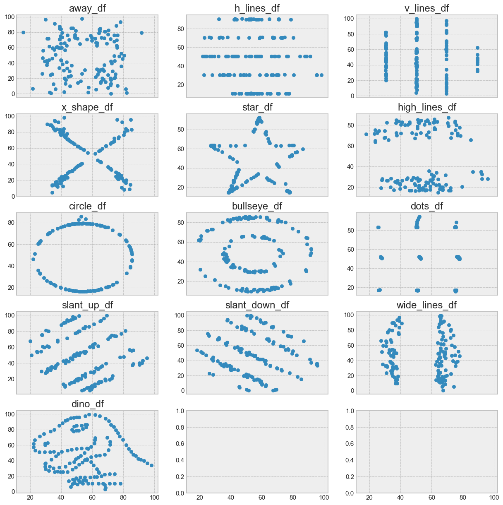

<!-- WARNING: THIS FILE WAS AUTOGENERATED! DO NOT EDIT! Instead, edit the notebook w/the location & name as this file. -->

## What is EDA?
Classical Statistical analysis was almost always focusing on what's known inferential statistics by deriving estimates about a population or by by hypotheses testing or confirmatory data analysis.

Confirmatory Data analysis is For example, when you want to know if a new drug is effective in treating a disease. Your hypothesis could be that the drug is effective, and you want to use data to prove that. so you design an experiment where you give the drug to a group of patients and you give a placebo to another group of patients. You then measure the outcome of the disease in both groups and compare the results. If the results show that that to a certain degree of confidence (p-value) the drug is effective, you can conclude that your hypothesis was correct. This is an example of confirmatory data analysis.

estimating parameters about a population is for example when you're looking to see how many of the university community like a certain service at the university. You can't ask everyone. I mean it's difficult enough to get students to submit assignments on time. So you take a sample of students and ask them. You then use the sample to estimate the number of students who like the service. This is an example of estimating parameters about a population.

so in 1961, John Tukey, a prominent mathematician and a statistician, coined the term Exploratory Data Analysis (EDA). That is a process of analyzing data sets for seeing what the data can tell us beyond the formal modeling or hypothesis testing task. a process, where the hypothesis can be suggested by the data itself, not just using the data to confirm or reject a hypothesis suggested by the researcher.


The basic **goals** or EDA are:
1. remove or correct erroneous data - data cleaning 
2. formulate initial hypotheses and draw on a few insights based on the initial investigations of the data.
3. choose suitable analysis methods

For that we need to 
LOOK AT THE DATA - SEE THE DATA

For that we need:
- Statistics
- Data Cleaning techniques
- Data Visualizations

They'll all go hand in hand. Statistics will help you understand some insights about the data. That understanding and those insights will help us in data cleaning and I will show a few examples there. Also just looking at the Raw data may cause us to miss huge opportunities and insights in the data. The Raw data and the statistics by them selves can deceiving sometimes.
And Visualizing the data will help you in coming up with your initial hypothesis about the data and determine the appropriate analysis methods and models. Sometimes even, visualization will help you in data cleaning and data understanding as you'll see statistics can be deceiving sometimes.


**This is an iterative process**
Remember, the data analysis process is not linear, it is an iterative, incremental process; 
we don't collect data, then clean the data, then analyze the data. 
Instead this all happens in iterations; we collect the data, and do some initial analysis, based on which we clean the data, then do some more analysis, then maybe we then realize we don't have enough data for the analysis so we go back and collect some more and so on and so forth.

I say this because I want to emphasize that EDA is not a one-time thing. 
and because many of the topics we will cover in this module are topics that we'll keep coming back to again and again throughout the course, with more information. 


But before we do any of that, we need to start with a tidy data. and that will be out topic for the next video.

## Tidy Data and Data structures

> Happy families are all alike; every unhappy family is unhappy in its own way
> 
> _Leo Tolstoy_

That's how Leo Tolstoy started his Anna Karenina Novel. So how does it relate to us here in data analysis?

Well it turns out, that we have some defined characteristics of what would be deemed as tidy data for example in Rectangular Data Structures: 
- Every variable/attribute/feature forms a column
- Every observation forms a row
- Every type of observational unit forms a table

But if we think about what could be considered an untidy table, there's too many possibilities

- you could have those merged rows that act as separators
- You could have tally rows
- You could have column headers that are actually a table description

All of these are issues we have to tidy up before we can start with our analysis.

But Data generally don't come in this structured state: text and images for example, they first need to be processed and manipulated so that it can be represented as a set of features in tabular structure.

Let's take an picture example, at the end of the day, pictures are just pixels. where every pixel has an attribute of RGB, for colored pictures, and maybe on and off for black and white pictures.

If we wanted to represent this image in rectangular data structure/a data frame: and Let's assume that 0 means white, 1 means red, we can have this table here. However would this fit the description as tidy data?

Well, no, rows and columns here basically a matrix, you'd want to convert that to table that has X, Y, and is_red as columns.

Table structured data is only one common forms of structured data; by no means we're saying it's only one.; what would be tidy for one analysis project may not be for another. For example, spatial data, which are used in mapping and location analytics.
Or graph and network data that are used to analyze relations between entities like social network relations.

so by no means we're saying that rectangular data structures are the only acceptable forms of structured data for analysis. Depending on your project, you'll want to choose the right form for your data.

What we've done here; converting this image or this raw source of information into a dataset is what's called data wrangling.
Converting this image to a dataset, parsing server log files to analyze web application traffic. In constructing the dataset, we also define the data types for each of the features. 

So looking at these 2 examples, you could see 2 different data types:
Numerical and Categorical

Let's talk about that in the next video.

## Data Types
There are 2 basic types of structured data:
- Numerical 
  - Continuous
  - Discrete
- Categorical
  - Ordinal
  - Nominal

<!-- *What to do here?*
- Temporal
  - Date of Birth; although we can break that down into a Ordinal data, for the years and month.
- Geographical
  - Positions: longitude and latitude, home address -->


Numerical values can be continuous, as it taking any value in an interval, like height, weight, and temperature; you can have 30.345 inches, 150.57 pounds, and 98.6 degrees Fahrenheit.
Or discrete; data that can only take integer values like number of children, number of cars, and number of pets. you can't have 1.5 children, 2.5 cars, or 1.5 pets.

and the other type of data is categorical: These are data that can only take specific set of values, representing possible categories.

For example, genders, and countries of athletes, rating scales on customer satisfaction surveys, letter grades of students in a class.
Categorical data are split into nominal data, theses are just labels, or ordinal data, where the order matters or carries a meaning. Letter Grades, A is better then B which is better than a C, a rating scale of 5 is better than one. However, the white color is not better then blue, that's ordinal data.

### Why do we care?
Why do we care about data types? Well, it's important to know what type of data you're dealing with, because different types of data require different types of analysis. You have to analyze continuous data differently than categorical data otherwise it would result in a wrong analysis.

Let's remember a few key terms of summary statistics, you may recall that we have 2 types of summary statistics:
- Central tendency measures: mean, median, mode
- and Dispersion measures: variance, standard deviation, range

For now, let's just focus on the central tendency measures, and let's look at the difference between mean and mode.

- Mean or the average: the sum of all the values divided by the number of values. 
- Mode: the most commonly occurring category or value in data set. - which only makes sense for categorical data.

So it's obvious that the mean is a summary statistic for continuous data, but the mode is a summary statistic for categorical data.
For a dataset of olympics athletes, you can get the mean of their ages, the mean of their heights, the mean of their weights, for example. It doesn't make sense to take the get the mean of their nationalities, of their sex. but you can get the mode of that.

Correctly computing Central Tendency measures becomes especially important when working on data cleaning and handling missing data as we'll talk about later.

Another example for why we care about data types is when we're talking about data visualization. Categorical data can be visualized using bar charts, pie charts, histograms, and so on. Continuous data can be visualized using line charts, scatter plots, and so on.

Also, when we're talking about data modeling and predictive analysis, we'll talk more about that later in the course, if you're trying to predict a continuous value like the price of a house, you'll use a regression model.
You'd use a logistical regression model if you're trying to predict predict whether a political candidate will win or lose an election, or a classification model if you're trying to predict whether a customer will buy a product or not.


```python
import pandas as pd

# read_table and read_csv are the same except for the default delimiter
auto_mpg_df = pd.read_table('./data/auto-mpg/auto-mpg.data', sep="\t", header=None, names=('mpg', 'cylinders','displacement','horsepower','weight','acceleration','model_year','origin','car_name'))
```


```python
#df.head() gets the first 5 rows, sample(5) gets 5 random rows
auto_mpg_df.sample(n=5)
```
    
<HTMLOutputBlock >


```html
<div>
<style scoped>
    .dataframe tbody tr th:only-of-type {
        vertical-align: middle;
    }

    .dataframe tbody tr th {
        vertical-align: top;
    }

    .dataframe thead th {
        text-align: right;
    }
</style>
<table border="1" class="dataframe">
  <thead>
    <tr style="text-align: right;">
      <th></th>
      <th>mpg</th>
      <th>cylinders</th>
      <th>displacement</th>
      <th>horsepower</th>
      <th>weight</th>
      <th>acceleration</th>
      <th>model_year</th>
      <th>origin</th>
      <th>car_name</th>
    </tr>
  </thead>
  <tbody>
    <tr>
      <th>114</th>
      <td>12.0</td>
      <td>8.0</td>
      <td>350.0</td>
      <td>180.0</td>
      <td>4499.0</td>
      <td>12.5</td>
      <td>73.0</td>
      <td>1.0</td>
      <td>oldsmobile vista cruiser</td>
    </tr>
    <tr>
      <th>40</th>
      <td>19.0</td>
      <td>6.0</td>
      <td>232.0</td>
      <td>100.0</td>
      <td>2634.0</td>
      <td>13.0</td>
      <td>71.0</td>
      <td>1.0</td>
      <td>amc gremlin</td>
    </tr>
    <tr>
      <th>247</th>
      <td>30.0</td>
      <td>4.0</td>
      <td>97.0</td>
      <td>67.0</td>
      <td>1985.0</td>
      <td>16.4</td>
      <td>77.0</td>
      <td>3.0</td>
      <td>subaru dl</td>
    </tr>
    <tr>
      <th>106</th>
      <td>16.0</td>
      <td>6.0</td>
      <td>250.0</td>
      <td>100.0</td>
      <td>3278.0</td>
      <td>18.0</td>
      <td>73.0</td>
      <td>1.0</td>
      <td>chevrolet nova custom</td>
    </tr>
    <tr>
      <th>179</th>
      <td>24.0</td>
      <td>4.0</td>
      <td>134.0</td>
      <td>96.0</td>
      <td>2702.0</td>
      <td>13.5</td>
      <td>75.0</td>
      <td>3.0</td>
      <td>toyota corona</td>
    </tr>
  </tbody>
</table>
</div>
```


</HTMLOutputBlock>


```python
# df.info() gives a summary about the data: number of rows, number of columns, column names, data types, number of non-null values
auto_mpg_df.info()
```

<CodeOutputBlock lang="python">

```
    <class 'pandas.core.frame.DataFrame'>
    RangeIndex: 409 entries, 0 to 408
    Data columns (total 9 columns):
     #   Column        Non-Null Count  Dtype  
    ---  ------        --------------  -----  
     0   mpg           400 non-null    float64
     1   cylinders     409 non-null    float64
     2   displacement  409 non-null    float64
     3   horsepower    403 non-null    float64
     4   weight        409 non-null    float64
     5   acceleration  409 non-null    float64
     6   model_year    409 non-null    float64
     7   origin        409 non-null    float64
     8   car_name      409 non-null    object 
    dtypes: float64(8), object(1)
    memory usage: 28.9+ KB
```

</CodeOutputBlock>


```python
# df.describe() gives statistical summaries of the data
auto_mpg_df.describe()
```
    
<HTMLOutputBlock >


```html
<div>
<style scoped>
    .dataframe tbody tr th:only-of-type {
        vertical-align: middle;
    }

    .dataframe tbody tr th {
        vertical-align: top;
    }

    .dataframe thead th {
        text-align: right;
    }
</style>
<table border="1" class="dataframe">
  <thead>
    <tr style="text-align: right;">
      <th></th>
      <th>mpg</th>
      <th>cylinders</th>
      <th>displacement</th>
      <th>horsepower</th>
      <th>weight</th>
      <th>acceleration</th>
      <th>model_year</th>
      <th>origin</th>
    </tr>
  </thead>
  <tbody>
    <tr>
      <th>count</th>
      <td>400.000000</td>
      <td>409.000000</td>
      <td>409.000000</td>
      <td>403.000000</td>
      <td>409.000000</td>
      <td>409.000000</td>
      <td>409.000000</td>
      <td>409.000000</td>
    </tr>
    <tr>
      <th>mean</th>
      <td>23.482000</td>
      <td>5.488998</td>
      <td>195.759169</td>
      <td>105.429280</td>
      <td>2986.088020</td>
      <td>15.496577</td>
      <td>75.897311</td>
      <td>1.564792</td>
    </tr>
    <tr>
      <th>std</th>
      <td>7.810255</td>
      <td>1.715129</td>
      <td>106.809049</td>
      <td>38.959819</td>
      <td>848.259456</td>
      <td>2.812496</td>
      <td>3.754633</td>
      <td>0.796027</td>
    </tr>
    <tr>
      <th>min</th>
      <td>9.000000</td>
      <td>3.000000</td>
      <td>4.000000</td>
      <td>46.000000</td>
      <td>1613.000000</td>
      <td>8.000000</td>
      <td>70.000000</td>
      <td>1.000000</td>
    </tr>
    <tr>
      <th>25%</th>
      <td>17.375000</td>
      <td>4.000000</td>
      <td>105.000000</td>
      <td>76.000000</td>
      <td>2228.000000</td>
      <td>13.600000</td>
      <td>73.000000</td>
      <td>1.000000</td>
    </tr>
    <tr>
      <th>50%</th>
      <td>23.000000</td>
      <td>4.000000</td>
      <td>151.000000</td>
      <td>95.000000</td>
      <td>2833.000000</td>
      <td>15.500000</td>
      <td>76.000000</td>
      <td>1.000000</td>
    </tr>
    <tr>
      <th>75%</th>
      <td>29.000000</td>
      <td>8.000000</td>
      <td>302.000000</td>
      <td>130.000000</td>
      <td>3630.000000</td>
      <td>17.100000</td>
      <td>79.000000</td>
      <td>2.000000</td>
    </tr>
    <tr>
      <th>max</th>
      <td>46.600000</td>
      <td>8.000000</td>
      <td>502.000000</td>
      <td>230.000000</td>
      <td>5140.000000</td>
      <td>24.800000</td>
      <td>82.000000</td>
      <td>3.000000</td>
    </tr>
  </tbody>
</table>
</div>
```


</HTMLOutputBlock>

Just looking at the info and the sample data, we could already see a few issues:
- the origin column is actually a categorical field not a numerical one.
  - Also looking at the stats for it: count, min, max, ... it looks like it can't only carry a value of 1, 2, or 3.
  - We can look at the data, and replace it with origin names, like US, Europe, and Asia.
- The model_year column is actually a *You tell me in the quiz*
- The cylinders column is a continuous numerical data, but it is actually a *You tell me in the quiz*

So not only are we doing data transformation, we're also doing some data wrangling and cleaning here.


```python
# The decimal point will be confusion to someone seeing the data
auto_mpg_df['origin'] = auto_mpg_df['origin'].astype(int)
# Make Origin a categorical variable
auto_mpg_df['origin'] = pd.Categorical(auto_mpg_df.origin)
auto_mpg_df.info()
```

<CodeOutputBlock lang="python">

```
    <class 'pandas.core.frame.DataFrame'>
    RangeIndex: 409 entries, 0 to 408
    Data columns (total 9 columns):
     #   Column        Non-Null Count  Dtype   
    ---  ------        --------------  -----   
     0   mpg           400 non-null    float64 
     1   cylinders     409 non-null    float64 
     2   displacement  409 non-null    float64 
     3   horsepower    403 non-null    float64 
     4   weight        409 non-null    float64 
     5   acceleration  409 non-null    float64 
     6   model_year    409 non-null    float64 
     7   origin        409 non-null    category
     8   car_name      409 non-null    object  
    dtypes: category(1), float64(7), object(1)
    memory usage: 26.2+ KB
```

</CodeOutputBlock>


```python
# Assuming for my analysis project, I want cylinders to be a numerical variable. In that case, it would be better to be a discrete variable
auto_mpg_df['cylinders'] = auto_mpg_df['cylinders'].astype('int')
auto_mpg_df.info()

# <Was that a good decision?>
```

<CodeOutputBlock lang="python">

```
    <class 'pandas.core.frame.DataFrame'>
    RangeIndex: 409 entries, 0 to 408
    Data columns (total 9 columns):
     #   Column        Non-Null Count  Dtype   
    ---  ------        --------------  -----   
     0   mpg           400 non-null    float64 
     1   cylinders     409 non-null    int64   
     2   displacement  409 non-null    float64 
     3   horsepower    403 non-null    float64 
     4   weight        409 non-null    float64 
     5   acceleration  409 non-null    float64 
     6   model_year    409 non-null    float64 
     7   origin        409 non-null    category
     8   car_name      409 non-null    object  
    dtypes: category(1), float64(6), int64(1), object(1)
    memory usage: 26.2+ KB
```

</CodeOutputBlock>


```python
# right now, model year is a to be a numerical field, and we realized that it's represented as values of 70, 71, 72, etc. If we want to add cars from the yar 2022, this column would be very confusing. and we so wee need to change those value by adding 1900 to each value.
# Please keep in mind, I'm confirming or denying the assumption that model year is a numerical variable. <You'll tell me that in the quiz>

auto_mpg_df['model_year'] = auto_mpg_df['model_year'] + 1900
auto_mpg_df

# Also you could do:
# auto_mpg_df['model_year'] = auto_mpg_df['model_year'].map(lambda x: x + 1900)
# OR
# auto_mpg_df['model_year'] = auto_mpg_df['model_year'].apply(lambda x: x + 1900)
```
    
<HTMLOutputBlock >


```html
<div>
<style scoped>
    .dataframe tbody tr th:only-of-type {
        vertical-align: middle;
    }

    .dataframe tbody tr th {
        vertical-align: top;
    }

    .dataframe thead th {
        text-align: right;
    }
</style>
<table border="1" class="dataframe">
  <thead>
    <tr style="text-align: right;">
      <th></th>
      <th>mpg</th>
      <th>cylinders</th>
      <th>displacement</th>
      <th>horsepower</th>
      <th>weight</th>
      <th>acceleration</th>
      <th>model_year</th>
      <th>origin</th>
      <th>car_name</th>
    </tr>
  </thead>
  <tbody>
    <tr>
      <th>0</th>
      <td>18.0</td>
      <td>8</td>
      <td>307.0</td>
      <td>130.0</td>
      <td>3504.0</td>
      <td>12.0</td>
      <td>1970.0</td>
      <td>1</td>
      <td>chevrolet chevelle malibu</td>
    </tr>
    <tr>
      <th>1</th>
      <td>15.0</td>
      <td>8</td>
      <td>350.0</td>
      <td>165.0</td>
      <td>3693.0</td>
      <td>11.5</td>
      <td>1970.0</td>
      <td>1</td>
      <td>buick skylark 320</td>
    </tr>
    <tr>
      <th>2</th>
      <td>18.0</td>
      <td>8</td>
      <td>318.0</td>
      <td>150.0</td>
      <td>3436.0</td>
      <td>11.0</td>
      <td>1970.0</td>
      <td>1</td>
      <td>plymouth satellite</td>
    </tr>
    <tr>
      <th>3</th>
      <td>16.0</td>
      <td>8</td>
      <td>304.0</td>
      <td>150.0</td>
      <td>3433.0</td>
      <td>12.0</td>
      <td>1970.0</td>
      <td>1</td>
      <td>amc rebel sst</td>
    </tr>
    <tr>
      <th>4</th>
      <td>17.0</td>
      <td>8</td>
      <td>302.0</td>
      <td>140.0</td>
      <td>3449.0</td>
      <td>10.5</td>
      <td>1970.0</td>
      <td>1</td>
      <td>ford torino</td>
    </tr>
    <tr>
      <th>...</th>
      <td>...</td>
      <td>...</td>
      <td>...</td>
      <td>...</td>
      <td>...</td>
      <td>...</td>
      <td>...</td>
      <td>...</td>
      <td>...</td>
    </tr>
    <tr>
      <th>404</th>
      <td>27.0</td>
      <td>4</td>
      <td>140.0</td>
      <td>86.0</td>
      <td>2790.0</td>
      <td>15.6</td>
      <td>1982.0</td>
      <td>1</td>
      <td>ford mustang gl</td>
    </tr>
    <tr>
      <th>405</th>
      <td>44.0</td>
      <td>4</td>
      <td>97.0</td>
      <td>52.0</td>
      <td>2130.0</td>
      <td>24.6</td>
      <td>1982.0</td>
      <td>2</td>
      <td>vw pickup</td>
    </tr>
    <tr>
      <th>406</th>
      <td>32.0</td>
      <td>4</td>
      <td>135.0</td>
      <td>84.0</td>
      <td>2295.0</td>
      <td>11.6</td>
      <td>1982.0</td>
      <td>1</td>
      <td>dodge rampage</td>
    </tr>
    <tr>
      <th>407</th>
      <td>28.0</td>
      <td>4</td>
      <td>120.0</td>
      <td>79.0</td>
      <td>2625.0</td>
      <td>18.6</td>
      <td>1982.0</td>
      <td>1</td>
      <td>ford ranger</td>
    </tr>
    <tr>
      <th>408</th>
      <td>31.0</td>
      <td>4</td>
      <td>119.0</td>
      <td>82.0</td>
      <td>2720.0</td>
      <td>19.4</td>
      <td>1982.0</td>
      <td>1</td>
      <td>chevy s-10</td>
    </tr>
  </tbody>
</table>
<p>409 rows × 9 columns</p>
</div>
```


</HTMLOutputBlock>


```python
auto_mpg_df.info()
```

<CodeOutputBlock lang="python">

```
    <class 'pandas.core.frame.DataFrame'>
    RangeIndex: 409 entries, 0 to 408
    Data columns (total 9 columns):
     #   Column        Non-Null Count  Dtype   
    ---  ------        --------------  -----   
     0   mpg           400 non-null    float64 
     1   cylinders     409 non-null    int64   
     2   displacement  409 non-null    float64 
     3   horsepower    403 non-null    float64 
     4   weight        409 non-null    float64 
     5   acceleration  409 non-null    float64 
     6   model_year    409 non-null    float64 
     7   origin        409 non-null    category
     8   car_name      409 non-null    object  
    dtypes: category(1), float64(6), int64(1), object(1)
    memory usage: 26.2+ KB
```

</CodeOutputBlock>


```python
# Merge the 2 dataframes, when you already have the another dataframe; I already showed this in a pervious notebook, so i won't run it.
# origins_df = pd.read_csv('./data/auto-mpg/origin.csv');

# auto_mpg_df = pd.merge(auto_mpg_df, origins_df, on='origin')
# auto_mpg_df.sample(5)
```


```python
auto_mpg_df['origin_spelled'] = auto_mpg_df['origin'].astype(str).map({'1':'US', '2':'European', '3': 'Asian'})
```


```python
auto_mpg_df.info()
```

<CodeOutputBlock lang="python">

```
    <class 'pandas.core.frame.DataFrame'>
    RangeIndex: 409 entries, 0 to 408
    Data columns (total 10 columns):
     #   Column          Non-Null Count  Dtype   
    ---  ------          --------------  -----   
     0   mpg             400 non-null    float64 
     1   cylinders       409 non-null    int64   
     2   displacement    409 non-null    float64 
     3   horsepower      403 non-null    float64 
     4   weight          409 non-null    float64 
     5   acceleration    409 non-null    float64 
     6   model_year      409 non-null    float64 
     7   origin          409 non-null    category
     8   car_name        409 non-null    object  
     9   origin_spelled  409 non-null    object  
    dtypes: category(1), float64(6), int64(1), object(2)
    memory usage: 29.4+ KB
```

</CodeOutputBlock>

<!-- by no means will I be able to show you everything, and I really shouldn't.  -->
you will learn a lot more about this topic the more you work with data.
But for now, you know the data types, we do we care about them, and how to tidy up your data to move on with the analysis.

## Data Cleaning

Now that we know about the data types we have in our data, we can start cleaning our data. Data cleaning is the process of fixing or removing incorrect, corrupted, incorrectly formatted, duplicate, or incomplete data within a dataset.

We start we a tidy dataset, we examine it, investigate it, and do some corrective actions to it, and and we end up with a clean dataset.
So what sorts of of issues do we clean up? Well, there's a lot of them, Like Leo Tolstoy mentioned, every family is unhappy in its own way, so every dataset is dirty in its own way. but we'll focus on the most common ones:
- Duplicate data
- Missing data
- Anomalies and outliers

### Duplicate Data
Let's start with duplicate data. Duplicate data is data that has been entered more than once. For example, if you have a dataset of customers, and you have a customer that has been entered twice, or more than twice, that's duplicate data. Or maybe you have a customer who filled out the same survey twice. That's duplicate data.

Duplicate data is a problem because it can skew your analysis, give the false impression that there's more data than there actually is.
So how do we deal with duplicate data? Well, we can remove it, or we can keep it. 
If you have a dataset of customers, and you have a customer that has been entered twice, you can remove one of them or merge the records, or you can keep them both.
It depends on the situation. In a huge dataset, a few duplicate records, may not do much. But if you're merging the data with another, that could cause problems. It really depends on your project and the problem space you're working on.

So let's see how we can find and handle duplicate records.

- [Pandas.DataFrame.duplicated ](https://pandas.pydata.org/docs/reference/api/pandas.DataFrame.duplicated.html)


```python
# this returns a series of booleans. You can pass some conditions to the functions, as to what needs to be considered in the comparison, and which record to be marked.
auto_mpg_df.duplicated()
```

<CodeOutputBlock lang="python">

```
    0      False
    1      False
    2      False
    3      False
    4      False
           ...  
    404    False
    405    False
    406    False
    407    False
    408    False
    Length: 409, dtype: bool
```

</CodeOutputBlock>


```python
# Because it's truncated for display, we can get the summation
auto_mpg_df.duplicated().sum()
```

<CodeOutputBlock lang="python">

```
    2
```

</CodeOutputBlock>


```python
# We can also filter the dataframe based on the results of the duplicated function
auto_mpg_df[auto_mpg_df.duplicated()]
```
    
<HTMLOutputBlock >


```html
<div>
<style scoped>
    .dataframe tbody tr th:only-of-type {
        vertical-align: middle;
    }

    .dataframe tbody tr th {
        vertical-align: top;
    }

    .dataframe thead th {
        text-align: right;
    }
</style>
<table border="1" class="dataframe">
  <thead>
    <tr style="text-align: right;">
      <th></th>
      <th>mpg</th>
      <th>cylinders</th>
      <th>displacement</th>
      <th>horsepower</th>
      <th>weight</th>
      <th>acceleration</th>
      <th>model_year</th>
      <th>origin</th>
      <th>car_name</th>
      <th>origin_spelled</th>
    </tr>
  </thead>
  <tbody>
    <tr>
      <th>255</th>
      <td>NaN</td>
      <td>8</td>
      <td>383.0</td>
      <td>175.0</td>
      <td>4166.0</td>
      <td>10.5</td>
      <td>1970.0</td>
      <td>1</td>
      <td>plymouth satellite (sw)</td>
      <td>US</td>
    </tr>
    <tr>
      <th>393</th>
      <td>16.0</td>
      <td>8</td>
      <td>400.0</td>
      <td>180.0</td>
      <td>4220.0</td>
      <td>11.1</td>
      <td>1977.0</td>
      <td>1</td>
      <td>pontiac grand prix lj</td>
      <td>US</td>
    </tr>
  </tbody>
</table>
</div>
```


</HTMLOutputBlock>


```python
# Filter out the duplicates from the dataframe based on the results of the duplicated function
auto_mpg_without_duplicates1 = auto_mpg_df[~auto_mpg_df.duplicated()]
# Let's check now?
auto_mpg_without_duplicates1.duplicated().sum()
```

<CodeOutputBlock lang="python">

```
    0
```

</CodeOutputBlock>


```python
# we didn't change the original dataframe, to do that, use the 
auto_mpg_df.duplicated().sum()
```

<CodeOutputBlock lang="python">

```
    2
```

</CodeOutputBlock>


```python
auto_mpg_without_duplicates2 = auto_mpg_df.drop_duplicates()
# Let's check now?
auto_mpg_without_duplicates2.duplicated().sum()
```

<CodeOutputBlock lang="python">

```
    0
```

</CodeOutputBlock>


```python
# to change the original dataframe, use the inplace parameter
auto_mpg_df.drop_duplicates(inplace=True)
# OR
# auto_mpg_df = auto_mpg_df.drop_duplicates()
```


```python
auto_mpg_df.info()
```

<CodeOutputBlock lang="python">

```
    <class 'pandas.core.frame.DataFrame'>
    Int64Index: 407 entries, 0 to 408
    Data columns (total 10 columns):
     #   Column          Non-Null Count  Dtype   
    ---  ------          --------------  -----   
     0   mpg             399 non-null    float64 
     1   cylinders       407 non-null    int64   
     2   displacement    407 non-null    float64 
     3   horsepower      401 non-null    float64 
     4   weight          407 non-null    float64 
     5   acceleration    407 non-null    float64 
     6   model_year      407 non-null    float64 
     7   origin          407 non-null    category
     8   car_name        407 non-null    object  
     9   origin_spelled  407 non-null    object  
    dtypes: category(1), float64(6), int64(1), object(2)
    memory usage: 32.3+ KB
```

</CodeOutputBlock>

### Missing Data, Anamolies, and Outliers
In working with data, you will have to deal with missing data, anomalies, and outliers.

Missing data is when you have a record, with a number of properties and some of those property values are missing. Maybe even values are are clearly incorrect. Like an age field of 0.
Anomalies and outliers are for example when you have a record that seems incorrect, but may actually be true. Like, if I tell you that Bangladesh, the country that is slightly bigger than the state of New York, has a more people than Russia. That's an anomaly, but it's true. Or maybe you have a record of a person who's 5 feet tall, and weighs 300 pounds. That's an outlier, but could be true.
and sometime you'll have to ask yourself the question: Is this an outlier or an anamoly that would mess up or skew your result, or is it a key finding or key observation.


or so how we handle those data issues: you could remove the records altogether, or you could substitute the data with some other value. 
Your project is what would determine the right approach here.

Also, This other value needs to fit within the dataset, not cause issues itself. It shouldn't skew the results itself. so what would this value be?
  - Handling of Missing data
    - Do you remove those records altogether, do you substitute those missing data with some other value
      - what would that value be? We need what we call a typical value?

This is where Statistics comes to the rescue once more. Central tendency measures along with some data visualizations would help us find those values. Depending on the type of the data, we could replace the data with the mean or the mode. In some cases, the median could make more sense to use as well.

There are different variations of the mean values that we can compute: We already talked about the normal mean, but I also want to introduce you to the another variation here, the trimmed mean.
This is when you calculate it by dropping a fixed number of sorted values at each end and then taking an average of the remaining values. A trimmed mean eliminates the influence of extreme values. For example, in international diving the top score and bottom score from five judges are dropped, and the final score is the average of the scores from the three remaining judges. This makes it difficult for a single judge to manipulate the score, perhaps to favor their country’s contestant.

In some cases, using the median would be a better choice. The median is the middle number on a sorted list of the data. Compared to the mean, which uses all observations, the median depends only on the values in the center of the sorted data. Let’s say we want to look at typical household incomes in neighborhoods around Lake Washington in Seattle. In comparing the Medina neighborhood to the Windermere neighborhood, using the mean would produce very different results because Bill Gates lives in Medina. If we use the median, it won’t matter how rich Bill Gates is—the position of the middle observation will remain the same. and the median here would be more representative of the typical value.

The median is not influenced by outliers, so it's a more robust estimate of location.

You should be able to use simple pandas operations to substitute those values.

But let's see how we can get those values in the first place.


```python
auto_mpg_df.describe()
```
    
<HTMLOutputBlock >


```html
<div>
<style scoped>
    .dataframe tbody tr th:only-of-type {
        vertical-align: middle;
    }

    .dataframe tbody tr th {
        vertical-align: top;
    }

    .dataframe thead th {
        text-align: right;
    }
</style>
<table border="1" class="dataframe">
  <thead>
    <tr style="text-align: right;">
      <th></th>
      <th>mpg</th>
      <th>cylinders</th>
      <th>displacement</th>
      <th>horsepower</th>
      <th>weight</th>
      <th>acceleration</th>
      <th>model_year</th>
    </tr>
  </thead>
  <tbody>
    <tr>
      <th>count</th>
      <td>399.000000</td>
      <td>407.000000</td>
      <td>407.000000</td>
      <td>401.000000</td>
      <td>407.000000</td>
      <td>407.000000</td>
      <td>407.000000</td>
    </tr>
    <tr>
      <th>mean</th>
      <td>23.500752</td>
      <td>5.476658</td>
      <td>194.797297</td>
      <td>105.069825</td>
      <td>2980.157248</td>
      <td>15.519656</td>
      <td>1975.909091</td>
    </tr>
    <tr>
      <th>std</th>
      <td>7.811039</td>
      <td>1.710247</td>
      <td>106.180724</td>
      <td>38.721120</td>
      <td>846.093527</td>
      <td>2.799904</td>
      <td>3.752056</td>
    </tr>
    <tr>
      <th>min</th>
      <td>9.000000</td>
      <td>3.000000</td>
      <td>4.000000</td>
      <td>46.000000</td>
      <td>1613.000000</td>
      <td>8.000000</td>
      <td>1970.000000</td>
    </tr>
    <tr>
      <th>25%</th>
      <td>17.500000</td>
      <td>4.000000</td>
      <td>104.500000</td>
      <td>76.000000</td>
      <td>2227.000000</td>
      <td>13.700000</td>
      <td>1973.000000</td>
    </tr>
    <tr>
      <th>50%</th>
      <td>23.000000</td>
      <td>4.000000</td>
      <td>151.000000</td>
      <td>95.000000</td>
      <td>2830.000000</td>
      <td>15.500000</td>
      <td>1976.000000</td>
    </tr>
    <tr>
      <th>75%</th>
      <td>29.000000</td>
      <td>8.000000</td>
      <td>302.000000</td>
      <td>130.000000</td>
      <td>3616.500000</td>
      <td>17.150000</td>
      <td>1979.000000</td>
    </tr>
    <tr>
      <th>max</th>
      <td>46.600000</td>
      <td>8.000000</td>
      <td>502.000000</td>
      <td>230.000000</td>
      <td>5140.000000</td>
      <td>24.800000</td>
      <td>1982.000000</td>
    </tr>
  </tbody>
</table>
</div>
```


</HTMLOutputBlock>


```python
from scipy.stats import trim_mean

auto_displacement_mean = auto_mpg_df['displacement'].mean()
auto_displacement_trimmed_mean = trim_mean(auto_mpg_df['displacement'], 0.1)
auto_displacement_median = auto_mpg_df['displacement'].median()

print("mean is {}, trimmed mean is {}, median is {}".format(auto_displacement_mean, auto_displacement_trimmed_mean, auto_displacement_median))
```

<CodeOutputBlock lang="python">

```
    mean is 194.7972972972973, trimmed mean is 184.2584097859327, median is 151.0
```

</CodeOutputBlock>

Next we need to find the missing fields and decide how we want to handle them


```python
# Find the missing data
auto_mpg_df.isnull().sum()
```

<CodeOutputBlock lang="python">

```
    mpg               8
    cylinders         0
    displacement      0
    horsepower        6
    weight            0
    acceleration      0
    model_year        0
    origin            0
    car_name          0
    origin_spelled    0
    dtype: int64
```

</CodeOutputBlock>


```python
# Looks like we have  8 missing values in the mpg column and 6 missing values in the horsepower column
# Let's see what those rows look like
auto_mpg_df[auto_mpg_df['mpg'].isnull()]
```
    
<HTMLOutputBlock >


```html
<div>
<style scoped>
    .dataframe tbody tr th:only-of-type {
        vertical-align: middle;
    }

    .dataframe tbody tr th {
        vertical-align: top;
    }

    .dataframe thead th {
        text-align: right;
    }
</style>
<table border="1" class="dataframe">
  <thead>
    <tr style="text-align: right;">
      <th></th>
      <th>mpg</th>
      <th>cylinders</th>
      <th>displacement</th>
      <th>horsepower</th>
      <th>weight</th>
      <th>acceleration</th>
      <th>model_year</th>
      <th>origin</th>
      <th>car_name</th>
      <th>origin_spelled</th>
    </tr>
  </thead>
  <tbody>
    <tr>
      <th>10</th>
      <td>NaN</td>
      <td>4</td>
      <td>133.0</td>
      <td>115.0</td>
      <td>3090.0</td>
      <td>17.5</td>
      <td>1970.0</td>
      <td>2</td>
      <td>citroen ds-21 pallas</td>
      <td>European</td>
    </tr>
    <tr>
      <th>11</th>
      <td>NaN</td>
      <td>8</td>
      <td>350.0</td>
      <td>165.0</td>
      <td>4142.0</td>
      <td>11.5</td>
      <td>1970.0</td>
      <td>1</td>
      <td>chevrolet chevelle concours (sw)</td>
      <td>US</td>
    </tr>
    <tr>
      <th>12</th>
      <td>NaN</td>
      <td>8</td>
      <td>351.0</td>
      <td>153.0</td>
      <td>4034.0</td>
      <td>11.0</td>
      <td>1970.0</td>
      <td>1</td>
      <td>ford torino (sw)</td>
      <td>US</td>
    </tr>
    <tr>
      <th>13</th>
      <td>NaN</td>
      <td>8</td>
      <td>383.0</td>
      <td>175.0</td>
      <td>4166.0</td>
      <td>10.5</td>
      <td>1970.0</td>
      <td>1</td>
      <td>plymouth satellite (sw)</td>
      <td>US</td>
    </tr>
    <tr>
      <th>14</th>
      <td>NaN</td>
      <td>8</td>
      <td>360.0</td>
      <td>175.0</td>
      <td>3850.0</td>
      <td>11.0</td>
      <td>1970.0</td>
      <td>1</td>
      <td>amc rebel sst (sw)</td>
      <td>US</td>
    </tr>
    <tr>
      <th>17</th>
      <td>NaN</td>
      <td>8</td>
      <td>302.0</td>
      <td>140.0</td>
      <td>3353.0</td>
      <td>8.0</td>
      <td>1970.0</td>
      <td>1</td>
      <td>ford mustang boss 302</td>
      <td>US</td>
    </tr>
    <tr>
      <th>39</th>
      <td>NaN</td>
      <td>4</td>
      <td>97.0</td>
      <td>48.0</td>
      <td>1978.0</td>
      <td>20.0</td>
      <td>1971.0</td>
      <td>2</td>
      <td>volkswagen super beetle 117</td>
      <td>European</td>
    </tr>
    <tr>
      <th>369</th>
      <td>NaN</td>
      <td>4</td>
      <td>121.0</td>
      <td>110.0</td>
      <td>2800.0</td>
      <td>15.4</td>
      <td>1981.0</td>
      <td>2</td>
      <td>saab 900s</td>
      <td>European</td>
    </tr>
  </tbody>
</table>
</div>
```


</HTMLOutputBlock>


```python
# Assuming the analytics project here involves a step to predict the mpg of a car, we can't use these rows. So we'll drop them
auto_mpg_df.dropna(subset=['mpg'], inplace=True)

#Then we confirm that we don't have any missing values in the mpg column
auto_mpg_df.isnull().sum()
```

<CodeOutputBlock lang="python">

```
    mpg               0
    cylinders         0
    displacement      0
    horsepower        6
    weight            0
    acceleration      0
    model_year        0
    origin            0
    car_name          0
    origin_spelled    0
    dtype: int64
```

</CodeOutputBlock>

For the horsepower, and before we decide how to handle it, we need to calculate the central tendency measures and and visualize it to see if we can find any patterns or anomalies in it. and to determine what would be the better central tendency measure to use to replace the missing values.


```python
auto_mpg_df['displacement'].describe()
```

<CodeOutputBlock lang="python">

```
    count    399.000000
    mean     193.447368
    std      105.563056
    min        4.000000
    25%      102.500000
    50%      146.000000
    75%      262.000000
    max      502.000000
    Name: displacement, dtype: float64
```

</CodeOutputBlock>


```python
import matplotlib as mpl
import matplotlib.pyplot as plt
# plt.style.use("bmh")


fig, ax = plt.subplots(figsize = (8,4))

auto_mpg_df['displacement'].plot(kind="hist", density= True, bins=30, alpha = 0.65)
auto_mpg_df['displacement'].plot(kind="kde")

ax.axvline(auto_displacement_mean, alpha = 0.8, linestyle = ":")
ax.axvline(auto_displacement_median, alpha = 0.8, linestyle = ":")
ax.axvline(auto_displacement_trimmed_mean, alpha = 0.8, linestyle = ":")

ax.set_ylim(0, .011)
ax.set_yticklabels([])
ax.set_ylabel("")

ax.text(auto_displacement_mean-.1, .01, "Mean", size = 10, alpha = 0.8)
ax.text(auto_displacement_median-.4, .0075, "Median", size = 10, alpha = 0.8)
ax.text(auto_displacement_trimmed_mean+.4, .0050, "Trimmed Mean", size = 10, alpha = 0.8)

ax.tick_params(left = False, bottom = False)
for ax, spine in ax.spines.items():
    spine.set_visible(False)

plt.show()
```

<CodeOutputBlock lang="python">

```
    

    
```

</CodeOutputBlock>


```python
# We can can then use those values to substitute the missing data. so we'll use the median value to fill the missing values in the horsepower column
auto_mpg_df['horsepower'].fillna(auto_mpg_df['horsepower'].median(), inplace=True)
```


```python
auto_mpg_df.isnull().sum()
```

<CodeOutputBlock lang="python">

```
    mpg               0
    cylinders         0
    displacement      0
    horsepower        0
    weight            0
    acceleration      0
    model_year        0
    origin            0
    car_name          0
    origin_spelled    0
    dtype: int64
```

</CodeOutputBlock>

You could also see a visual of all the features histograms in one plot, to see if there are any patterns or anomalies in the data, see the frequency of the values for categorical data, and where the the majority of the data is located for the numerical data.


```python
import matplotlib as mpl
import matplotlib.pyplot as plt

auto_mpg_df.hist(bins=50, figsize=(20,15))
plt.show()
```

<CodeOutputBlock lang="python">

```
    

    
```

</CodeOutputBlock>

You could employ similar techniques to deal with outliers and anomalies. You could remove them, or you could replace them with some other value. But you need to be careful here, because you don't want to replace them with a value that would skew the results.
Or you if your analysis is about finding the most performant cars, then you may want to keep those outliers in the dataset. In that case they're be considered key observations.
We use other statistical concepts from statistics to deal with outliers and anomalies, namely measures of variability and data distribution: standard deviation, variances, percentiles.

Please make sure you do the reading and the exercises for this section. It's very important to understand the concepts here.


```python
## On outliers, here's how we can detect them
auto_mpg_df['displacement'].plot(kind="box")
```

<CodeOutputBlock lang="python">

```
    <AxesSubplot: >


    

    
```

</CodeOutputBlock>


```python
# Once you have the box plot, you can use the whiskers to determine the outliers.
# The whiskers are the lines that extend from the box. The top whisker is the 75th percentile, and the bottom whisker is the 25th percentile.
# The outliers are the points that are outside the whiskers.

# We can also use the describe function to get the 25th and 75th percentile
auto_mpg_df['displacement'].describe()

# We can also use the quantile function to get the 25th and 75th percentile
auto_mpg_df['displacement'].quantile([0.25, 0.75])
```

<CodeOutputBlock lang="python">

```
    0.25    102.5
    0.75    262.0
    Name: displacement, dtype: float64
```

</CodeOutputBlock>


```python
# We can also use the IQR function to get the 25th and 75th percentile
Q1 = auto_mpg_df['displacement'].quantile(0.25)
Q3 = auto_mpg_df['displacement'].quantile(0.75)
print("Q1 is {} and Q3 is {}".format(Q1, Q3))
IQR = Q3 - Q1
print("IQR is {}".format(IQR))

lower_bound = Q1 - 1.5 * IQR
upper_bound = Q3 + 1.5 * IQR

print("The lower bound is {}, and the upper bound is {}".format(lower_bound, upper_bound))

## Records where the displacement values are outside the lower and upper bounds are outliers
auto_mpg_df[(auto_mpg_df['displacement'] < lower_bound) | (auto_mpg_df['displacement'] > upper_bound)]
```
    
<HTMLOutputBlock >

    Q1 is 102.5 and Q3 is 262.0
    IQR is 159.5
    The lower bound is -136.75, and the upper bound is 501.25


```html
<div>
<style scoped>
    .dataframe tbody tr th:only-of-type {
        vertical-align: middle;
    }

    .dataframe tbody tr th {
        vertical-align: top;
    }

    .dataframe thead th {
        text-align: right;
    }
</style>
<table border="1" class="dataframe">
  <thead>
    <tr style="text-align: right;">
      <th></th>
      <th>mpg</th>
      <th>cylinders</th>
      <th>displacement</th>
      <th>horsepower</th>
      <th>weight</th>
      <th>acceleration</th>
      <th>model_year</th>
      <th>origin</th>
      <th>car_name</th>
      <th>origin_spelled</th>
    </tr>
  </thead>
  <tbody>
    <tr>
      <th>43</th>
      <td>18.0</td>
      <td>6</td>
      <td>502.0</td>
      <td>100.0</td>
      <td>3282.0</td>
      <td>15.5</td>
      <td>1971.0</td>
      <td>1</td>
      <td>outlier car</td>
      <td>US</td>
    </tr>
  </tbody>
</table>
</div>
```


</HTMLOutputBlock>


```python
# That record doesn't look like a real data, so we'll drop it
auto_mpg_df.drop(auto_mpg_df[(auto_mpg_df['displacement'] < lower_bound) | (auto_mpg_df['displacement'] > upper_bound)].index, inplace=True)
```

## About Statistical Analysis
- [Statistics Cheatsheet](./assets/statistics-cheat-sheet.pdf)

In this video we lightly touched on so many topics. 

## Data Visualization

I've mentioned to you before that for you do a good EDA, you need to
LOOK AT THE DATA - SEE THE DATA - UNDERSTAND THE DATA


Statistical analysis is very important for EDA and descriptive analysis, but it's not the only thing you need to do.
In fact, depending solely on statistical analysis can lead to wrong conclusions, and wrong analysis. It could lead to wrong data cleaning, and wrong data modeling.
and we've seen how visualizations can help us in understanding the data. and cleaning it. 

Let's take a look at this dataset:


```python
import pandas as pd

datasaurus = pd.read_table("./data/datasaurus.tsv")
datasaurus.head(5)
```
    
<HTMLOutputBlock >


```html
<div>
<style scoped>
    .dataframe tbody tr th:only-of-type {
        vertical-align: middle;
    }

    .dataframe tbody tr th {
        vertical-align: top;
    }

    .dataframe thead th {
        text-align: right;
    }
</style>
<table border="1" class="dataframe">
  <thead>
    <tr style="text-align: right;">
      <th></th>
      <th>dataset</th>
      <th>x</th>
      <th>y</th>
    </tr>
  </thead>
  <tbody>
    <tr>
      <th>0</th>
      <td>dino</td>
      <td>55.3846</td>
      <td>97.1795</td>
    </tr>
    <tr>
      <th>1</th>
      <td>dino</td>
      <td>51.5385</td>
      <td>96.0256</td>
    </tr>
    <tr>
      <th>2</th>
      <td>dino</td>
      <td>46.1538</td>
      <td>94.4872</td>
    </tr>
    <tr>
      <th>3</th>
      <td>dino</td>
      <td>42.8205</td>
      <td>91.4103</td>
    </tr>
    <tr>
      <th>4</th>
      <td>dino</td>
      <td>40.7692</td>
      <td>88.3333</td>
    </tr>
  </tbody>
</table>
</div>
```


</HTMLOutputBlock>


```python
# Split the data into multiple dataframes
dino_df = datasaurus[datasaurus["dataset"] == "dino"]
away_df = datasaurus[datasaurus["dataset"] == "away"]
h_lines_df = datasaurus[datasaurus["dataset"] == "h_lines"]
v_lines_df = datasaurus[datasaurus["dataset"] == "v_lines"]
x_shape_df = datasaurus[datasaurus["dataset"] == "x_shape"]
star_df = datasaurus[datasaurus["dataset"] == "star"]
high_lines_df = datasaurus[datasaurus["dataset"] == "high_lines"]
circle_df = datasaurus[datasaurus["dataset"] == "circle"]
bullseye_df = datasaurus[datasaurus["dataset"] == "bullseye"]
dots_df = datasaurus[datasaurus["dataset"] == "dots"]
slant_up_df = datasaurus[datasaurus["dataset"] == "slant_up"]
slant_down_df = datasaurus[datasaurus["dataset"] == "slant_down"]
wide_lines_df = datasaurus[datasaurus["dataset"] == "wide_lines"]
```


```python
print("\ndino_df")
print(dino_df.describe())
print("\naway_df")
print(away_df.describe())
print("\nh_lines_df")
print(h_lines_df.describe())
print("\nv_lines_df")
print(v_lines_df.describe())
```

<CodeOutputBlock lang="python">

```
    
    dino_df
                    x           y
    count  142.000000  142.000000
    mean    54.263273   47.832253
    std     16.765142   26.935403
    min     22.307700    2.948700
    25%     44.102600   25.288450
    50%     53.333300   46.025600
    75%     64.743600   68.525675
    max     98.205100   99.487200
    
    away_df
                    x           y
    count  142.000000  142.000000
    mean    54.266100   47.834721
    std     16.769825   26.939743
    min     15.560750    0.015119
    25%     39.724115   24.625892
    50%     53.340296   47.535269
    75%     69.146597   71.803148
    max     91.639961   97.475771
    
    h_lines_df
                    x           y
    count  142.000000  142.000000
    mean    54.261442   47.830252
    std     16.765898   26.939876
    min     22.003709   10.463915
    25%     42.293828   30.479911
    50%     53.069678   50.473527
    75%     66.768274   70.349471
    max     98.288123   90.458936
    
    v_lines_df
                    x           y
    count  142.000000  142.000000
    mean    54.269927   47.836988
    std     16.769959   26.937684
    min     30.449654    2.734760
    25%     49.964506   22.752884
    50%     50.362890   47.113616
    75%     69.504068   65.845391
    max     89.504851   99.694680
```

</CodeOutputBlock>


```python
import matplotlib.pyplot as plt
# import seaborn as sns
# sns.set()
plt.style.use("bmh")

fig, (
  (ax1,ax2,ax3),
  (ax4,ax5,ax6),
  (ax7,ax8,ax9),
  (ax10,ax11,ax12),
  (ax13,ax14,ax15)
) = plt.subplots(5,3, figsize=(15, 15), sharex=True)

ax1.scatter(away_df["x"], away_df["y"])
ax1.set_title("away_df")

ax2.scatter(h_lines_df["x"], h_lines_df["y"])
ax2.set_title("h_lines_df")

ax3.scatter(v_lines_df["x"], v_lines_df["y"])
ax3.set_title("v_lines_df")

ax4.scatter(x_shape_df["x"], x_shape_df["y"])
ax4.set_title("x_shape_df")

ax5.scatter(star_df["x"], star_df["y"])
ax5.set_title("star_df")

ax6.scatter(high_lines_df["x"], high_lines_df["y"])
ax6.set_title("high_lines_df")

ax7.scatter(circle_df["x"], circle_df["y"])
ax7.set_title("circle_df")

ax8.scatter(bullseye_df["x"], bullseye_df["y"])
ax8.set_title("bullseye_df")

ax9.scatter(dots_df["x"], dots_df["y"])
ax9.set_title("dots_df")

ax10.scatter(slant_up_df["x"], slant_up_df["y"])
ax10.set_title("slant_up_df")

ax11.scatter(slant_down_df["x"], slant_down_df["y"])
ax11.set_title("slant_down_df")

ax12.scatter(wide_lines_df["x"], wide_lines_df["y"])
ax12.set_title("wide_lines_df")

ax13.scatter(dino_df["x"], dino_df["y"])
ax13.set_title("dino_df")
```

<CodeOutputBlock lang="python">

```
    Text(0.5, 1.0, 'dino_df')


    

    
```

</CodeOutputBlock>

## Data Correlations

Exploratory data analysis involves examining correlation among features or properties or the columns and a target variable.

Later on, you'll learn that in machine learning, the amount of data you have matters a lot, and the more features you use, your more rows of observation records you need to have. for the model to be able to learn about the patterns between the different features.
One that that could help with that, is to find features that are highly correlated with each other, and remove one of them. This is called feature selection.

So what is correlation? Correlation is a statistical measure that indicates the extent to which two or more variables fluctuate together. It is used to identify the degree of relationship between two variables. The correlation coefficient is a statistical measure that indicates the strength of the relationship between two variables. It is a number between -1 and 1. A value of 1 indicates a perfect positive correlation, a value of -1 indicates a perfect negative correlation, and a value of 0 indicates no correlation at all. Correlation can be one of the measures used in inferential statistics to determine the strength of the relationship between two variables.

and as with everything in data science and data analysis, domain knowledge is needed to understand the results and not come up with bad conclusions.
- 


```python
corr_matrix = auto_mpg_df.corr()
corr_matrix
```
    
<HTMLOutputBlock >

    /var/folders/c_/2lqspw9x5ts9mgzxq7drs2400000gq/T/ipykernel_55303/1551412334.py:1: FutureWarning: The default value of numeric_only in DataFrame.corr is deprecated. In a future version, it will default to False. Select only valid columns or specify the value of numeric_only to silence this warning.
      corr_matrix = auto_mpg_df.corr()


```html
<div>
<style scoped>
    .dataframe tbody tr th:only-of-type {
        vertical-align: middle;
    }

    .dataframe tbody tr th {
        vertical-align: top;
    }

    .dataframe thead th {
        text-align: right;
    }
</style>
<table border="1" class="dataframe">
  <thead>
    <tr style="text-align: right;">
      <th></th>
      <th>mpg</th>
      <th>cylinders</th>
      <th>displacement</th>
      <th>horsepower</th>
      <th>weight</th>
      <th>acceleration</th>
      <th>model_year</th>
    </tr>
  </thead>
  <tbody>
    <tr>
      <th>mpg</th>
      <td>1.000000</td>
      <td>-0.775396</td>
      <td>-0.788607</td>
      <td>-0.773382</td>
      <td>-0.831741</td>
      <td>0.420289</td>
      <td>0.579267</td>
    </tr>
    <tr>
      <th>cylinders</th>
      <td>-0.775396</td>
      <td>1.000000</td>
      <td>0.937337</td>
      <td>0.841200</td>
      <td>0.896017</td>
      <td>-0.505419</td>
      <td>-0.348746</td>
    </tr>
    <tr>
      <th>displacement</th>
      <td>-0.788607</td>
      <td>0.937337</td>
      <td>1.000000</td>
      <td>0.876512</td>
      <td>0.915268</td>
      <td>-0.549899</td>
      <td>-0.357416</td>
    </tr>
    <tr>
      <th>horsepower</th>
      <td>-0.773382</td>
      <td>0.841200</td>
      <td>0.876512</td>
      <td>1.000000</td>
      <td>0.862380</td>
      <td>-0.686502</td>
      <td>-0.413649</td>
    </tr>
    <tr>
      <th>weight</th>
      <td>-0.831741</td>
      <td>0.896017</td>
      <td>0.915268</td>
      <td>0.862380</td>
      <td>1.000000</td>
      <td>-0.417457</td>
      <td>-0.306564</td>
    </tr>
    <tr>
      <th>acceleration</th>
      <td>0.420289</td>
      <td>-0.505419</td>
      <td>-0.549899</td>
      <td>-0.686502</td>
      <td>-0.417457</td>
      <td>1.000000</td>
      <td>0.288137</td>
    </tr>
    <tr>
      <th>model_year</th>
      <td>0.579267</td>
      <td>-0.348746</td>
      <td>-0.357416</td>
      <td>-0.413649</td>
      <td>-0.306564</td>
      <td>0.288137</td>
      <td>1.000000</td>
    </tr>
  </tbody>
</table>
</div>
```


</HTMLOutputBlock>

You could also get the correlation for a particular column. Let's say we want to see how the horsepower is correlated with the weight of the car. We could use the corr() method on the dataframe, and pass the column name as an argument to it.


```python
corr_matrix["horsepower"].sort_values(ascending=False)
```

<CodeOutputBlock lang="python">

```
    horsepower      1.000000
    displacement    0.876512
    weight          0.862380
    cylinders       0.841200
    model_year     -0.413649
    acceleration   -0.686502
    mpg            -0.773382
    Name: horsepower, dtype: float64
```

</CodeOutputBlock>

Data like this could aid in feature selection and can be used to determine removing one feature from the dataset to reduce the number of features, and thus the number of rows of data needed to train the model.

Looking at the data above here, it might be suggested that there's a high correlation between the horsepower and the weight of the car. But can you get rid of one and keep the other? With domain knowledge, you could learn that while there may be some correlation, it's not where if you need to increase the horsepower, you increase the weight. It's more of Because the weight is high, the horsepower needs to be high as well.

Domain knowledge could also dismiss that as a probable sampling issue where the data may not be representative of the population. There may be light cars with high horse power as well. So you can't just remove a feature because it's highly correlated with another feature.

Let me show you another way where you can see this correlation visually.


```python
from pandas.plotting import scatter_matrix

attributes = ["mpg", "weight", "displacement",
              "horsepower", "cylinders"]
scatter_matrix(auto_mpg_df[attributes], figsize=(12, 8))
```

<CodeOutputBlock lang="python">

```
    array([[<AxesSubplot: xlabel='mpg', ylabel='mpg'>,
            <AxesSubplot: xlabel='weight', ylabel='mpg'>,
            <AxesSubplot: xlabel='displacement', ylabel='mpg'>,
            <AxesSubplot: xlabel='horsepower', ylabel='mpg'>,
            <AxesSubplot: xlabel='cylinders', ylabel='mpg'>],
           [<AxesSubplot: xlabel='mpg', ylabel='weight'>,
            <AxesSubplot: xlabel='weight', ylabel='weight'>,
            <AxesSubplot: xlabel='displacement', ylabel='weight'>,
            <AxesSubplot: xlabel='horsepower', ylabel='weight'>,
            <AxesSubplot: xlabel='cylinders', ylabel='weight'>],
           [<AxesSubplot: xlabel='mpg', ylabel='displacement'>,
            <AxesSubplot: xlabel='weight', ylabel='displacement'>,
            <AxesSubplot: xlabel='displacement', ylabel='displacement'>,
            <AxesSubplot: xlabel='horsepower', ylabel='displacement'>,
            <AxesSubplot: xlabel='cylinders', ylabel='displacement'>],
           [<AxesSubplot: xlabel='mpg', ylabel='horsepower'>,
            <AxesSubplot: xlabel='weight', ylabel='horsepower'>,
            <AxesSubplot: xlabel='displacement', ylabel='horsepower'>,
            <AxesSubplot: xlabel='horsepower', ylabel='horsepower'>,
            <AxesSubplot: xlabel='cylinders', ylabel='horsepower'>],
           [<AxesSubplot: xlabel='mpg', ylabel='cylinders'>,
            <AxesSubplot: xlabel='weight', ylabel='cylinders'>,
            <AxesSubplot: xlabel='displacement', ylabel='cylinders'>,
            <AxesSubplot: xlabel='horsepower', ylabel='cylinders'>,
            <AxesSubplot: xlabel='cylinders', ylabel='cylinders'>]],
          dtype=object)


    

    
```

</CodeOutputBlock>

and from here you could see that the figure where the same property meets, is a histogram about the frequency of the data

https://courses.helsinki.fi/sites/default/files/course-material/4509270/IntroDS-03.pdf


#### Assignments
- Lab assignment on EDA
- For a particular problem set by me, what kinds of questions would you ask? what data sources would you use?


## References
- [Same Stats, Different Graphs: Generating Datasets with Varied Appearance and Identical Statistics through Simulated Annealing](https://www.autodesk.com/research/publications/same-stats-different-graphs)


