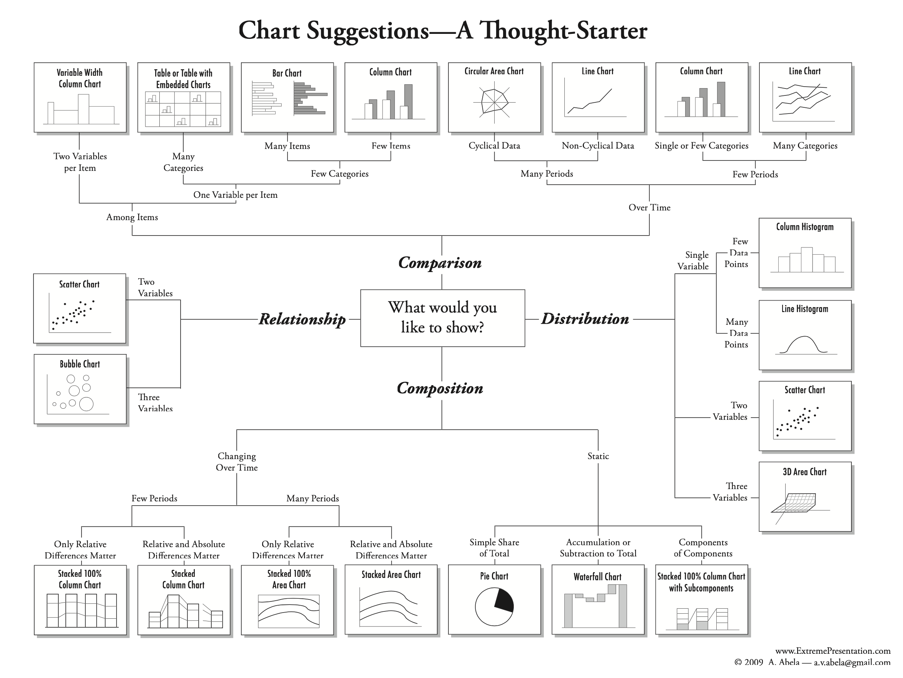

<!-- WARNING: THIS FILE WAS AUTOGENERATED! DO NOT EDIT! Instead, edit the notebook w/the location & name as this file. -->

## Overview
Data visualization is the process of transforming data into visual representations. It's a way to communicate information clearly and effectively.

In a pervious module, we talked about how data visualization aids in the exploratory data analysis process. and how relying on statistics alone can be misleading. In this module, we'll learn how to choose the right visualization for the right data, how to use visualizations to communicate our findings.
We will use different libraries to create visualizations. We will use `matplotlib` and `seaborn` to create static visualizations. We will use `plotly` to create interactive visualizations. We will use `folium` to create interactive maps.

Links to the libraries:
- [Matplotlib](https://matplotlib.org/) - a Python 2D plotting library which produces publication quality figures in a variety of hardcopy formats and interactive environments across platforms.
- [Seaborn](https://seaborn.pydata.org/) - a Python data visualization library based on matplotlib. It provides a high-level interface for drawing attractive and informative statistical graphics.
- [Plotly](https://plotly.com/python) - an open-source, interactive graphing library for Python.
- [altair](https://altair-viz.github.io/) - a declarative statistical visualization library for Python, based on Vega and Vega-Lite.
- [Plotnine](https://plotnine.readthedocs.io/en/stable/) - a grammar of graphics for Python based on ggplot2.
- [Bokeh](https://bokeh.org/) - an interactive visualization library that targets modern web browsers for presentation.
  - https://towardsdatascience.com/beautiful-and-easy-plotting-in-python-pandas-bokeh-afa92d792167
- [SweetViz](https://github.com/fbdesignpro/sweetviz) - an open-source Python library that generates beautiful, high-density visualizations to kickstart EDA (Exploratory Data Analysis) with a single line of code.
- [Folium](https://python-visualization.github.io/folium/) - a Python library for visualizing geospatial data.

## Motivation
* There's a distinction between Exploratory vs Explanatory Data Analysis:
  * Exploratory: We're trying to understand the data, find patterns, and relationships.
    * You try different visualizations and extract different insights from each one.
  * Explanatory: We're trying to communicate our findings to others.
* In your data analytics work, we will be doing both.
* It is of crucial importance to choose the right visualization for the right data.

## Choosing the right visualization
* There are many different types of visualizations.
* Depending on the data we have and the question we're trying to answer, we will need to choose a different visualization.
* We can break down the charting message types into multiple types:
  * Comparison charts
  * Composition charts
  * Distribution charts
  * Relationship charts

The following is a *thought starter* to choose a diagram for your data

- You can [download the chart as a PDF from here](./assets//thought-starter.pdf)

The best way to learn about this, is by practice. Not videos or tutorials. **Practice. Practice. Practice.**

In addition to this week's assignment on visualizing data, I recommend you to go through the following resources:
- [Data Visualization: A Practical Introduction](https://serialmentor.com/dataviz/)

- The following [Visual Reference](https://www.sqlbi.com/wp-content/uploads/visuals-reference-sep2018-A3.pdf) is a great resource to help you choose a visualization.
- Also, this is  is a great resource to help you choose a visualization.

https://courses.helsinki.fi/sites/default/files/course-material/4509270/IntroDS-03.pdf
