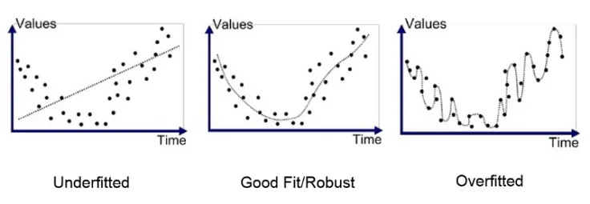

<!-- WARNING: THIS FILE WAS AUTOGENERATED! DO NOT EDIT! Instead, edit the notebook w/the location & name as this file. -->

## What is Machine Learning (ML)?
As humans, we are able to learn and get better at doing things and performing tasks. We're born knowing almost nothing, and can do almost nothing for ourselves. But we learn, we try, we improve and optimize. and with experience we get better. Computers can do something similar. (not exactly) that's what machine learning is.

Machine learning is the science of getting computers to act without being explicitly programmed to do so. It brings together the fields of statistics, algebra , and computer science to build algorithms that can learn from data.

Another good definition of what we can say machine learning is by Prof. Tom Mitchell of Carnegie Melon University in his book in 1997. He said 

> A computer program is said to learn from Experience E with respect to some class of tasks T and performance measure P if its performance at tasks in T, as measured by P, improves with experience E.
> 
> _Tom M. Mitchell_

Let's give break this definition down and see what it means.

- **Experience E**: What the machine learns from; The data we feed to the algorithm.
  - It's the datasets that we use to train the algorithm.
- **Tasks T**: What machine learns for; The tasks the algorithm is supposed to perform.
  - image classification, spam email detection, finding patterns in Medical Diagnosis, forecasting stock market prices, ...etc.
- **Performance measure P**: How well the machine learns; The measure of the algorithm's performance and accuracy.
  - Accuracy, Precision, Recall, F1-Score, ...etc.

So let's see a couple of examples here.

If we take filtering spam emails as an example, we can define the following:
- **Tasks T**: Filtering the spam emails.
- **Experience E**: the labelled emails from users; whether they marked them as spam or not.
- **Performance measure P**: the ratio of emails that are correctly classified as spam or not spam.

Machine learning is a very powerful tool, and it's used in many different fields.

It's used in the medical field, to help doctors diagnose patients, 
it's used in the financial field, to help banks detect fraud, 
it's used in the retail, to help companies recommend products to customers,
in the manufacturing, to help companies optimize their production lines, 
in the transportation field, to help companies optimize their routes,
in the energy, in agriculture, in entertainment, and the list goes on and on and on. 

Sounds like Data Science, right? Well, it is. Data Science is a field that uses machine learning to solve problems. so there's a bit of overlap.

So If we can have the computer teach itself, why do we program anything at all.

So when do we use Machine Learning? Let's talk about that in the next video.

## Why use Machine Learning?
> If the only tool you have is a hammer, you tend to see every problem as a nail.
>
> _The law of Instrument By Abraham Maslow_

Obviously not every problem is a nail and so we need to know when it's appropriate to use machine learning.

2 Factors to guide your decision here:
- The problem's complexity
- and/or the need for adaptivity in the solution you're building

### Tasks that are too complex to program
* **Tasks performed by animals or humans**: There's a lot of things that living beings do routinely , yet our introspection of how we do them and the process of doing it. is not elaborate enough to extract some well defined steps that we can program.
  * Speech recognition, understanding images and objects and shapes, and driving cars, playing chess. 
  * There's a lot of mental work that would be near impossible to program.

Let's take driving cars, if we're to build a self-driving car using programming and we can't just say "if you see another car don't crash into it". That statement alone is very complex.

You need to programmatically describe what is "another car", what are all the possible colors, shapes and sizes. 
And then you need to program it to understand that if you see a car, you don't just stop, you need to understand what that other car is doing, is it slowing down, is it stopping, is it speeding, is it getting into your lane.
What to do if you see a pedestrian, what to do you do when you see a traffic light,  a red-light stop, a green you move, unless there's a car or a pedestrian. and oh what is a pedestrian, we need to program what a pedestrian looks like. you need to define that programmatically.... `<fade>` 

and that's just one example of a single task. 
What machine learning allows us to do, is to just give the program a lot of data about how to drive,
quite like how we humans learn, provided the right mindset (algorithm), the use all of our senses (data), for the computer that could sensors, cameras, ... so on. and the longer we drive and practice, the more scenarios we're put in, the better we get at driving and developing a model that can drive.

Another class of tasks that are too complex to program are tasks that are beyond the human capability.
* **Tasks Beyond Human Capability**: Things like analyzing very large and very complex data sets, finding patterns in millions of correlated records, learning from the purchasing patterns of customers around the different events, holidays, seasons, ... We have a lot of data, but without tools like machine learning we wouldn't be able to extract the value from it.
* The purchase patterns of customers around different events, holidays, seasons, ...etc.

The second factor here for when to use machine learning is when you need adaptivity in the solution you're building.
### Tasks that require adaptivity
Programmed solutions are rigid, once the program is written and installed, it can't change. Machine learning algorithms are flexible, they can change and adapt to new data, new experiences, ... so on.

For example if you're building a software that classifies emails to spam or not spam, Using simple analysis, you can find that maybe 99% of emails contains "4 U". so you code a program that if it sees "4 U", it's a spam. Spammers may notice that they're being filters out, so they start using "For U" instead., ...etc. so you need to keep updating your program to keep up with the spammers.
Also in speech recognition, when you do hey Siri, or ok google. You need the program to adapt to different accents and dialects.

These sorts of problem is when we find that we need a near human-intelligence, and that's where machine learning comes in.

Within that context, you can see a lot of applications of machine learning.
## Applications of ML
- Analyzing images of products on a production line to detect defects and classify them automatically.
- Detecting tumors in brain scans or body scans, if you know the markers you look for.

- Creating a recommendation system for a website, to recommend products to users based on their previous purchases.
- Or letting the computer learn similarities and cluster similar data point together which may and has been used to identify new patterns and clusters of data that we didn't know existed.
- Segmenting customers based on their purchasing patterns, to create targeted marketing campaigns (clustering).
- Finding new patterns in the tumor scans that led to discovering new markers for cancer.
- Forecasting and optimizing a company revenue, based on historical data (time series analysis).

The list will go on and on and it will keep growing as we keep discovering new applications for machine learning, and there are way too many algorithms to cover in one course. We will cover some of the common ones.

But it'll still be helpful to know the different types of machine learning algorithms and the different classes of tasks that they can help us solve.

and we'll talk about that in the next video.

## Types of ML Systems:
Learning, even for humans, is very wide domain, and has different types and styles, and so it is for machine learning as well. It is branched out into many different subfields and subdomains. 

In this video we will get top view of the different types of machine learning systems.

Three are different ways to classify machine learning systems, or to distinguish between them, like:
- Whether or not they are trained with human supervision (supervised, unsupervised, semisupervised, and reinforcement learning).
- weather or not they can learn incrementally on the fly (online versus batch learning).
- weather or not they work by simply comparing new data points to known data points, or instead detect patterns in the training data and build a predictive model, much like humans do (instance-based versus model-based learning).

I will only talk about the first one, the other two may be covered as they arise in the rest of the course.

When we look at the data from its learning supervision style, we find that we have those types:
  - **Supervised Learning**
    - for supervised learning, the training data you feed to the algorithm includes known data with the problem and solution kinda thing. The features in the data and the target data.  We call those in this context, labels or labeled data. 

the algorithm learns from that data, create a model based on the patterns and the rules  it was able to see in the data. 

Now if we give some unlabeled data, it would be able to use that model to predict or estimate a correct answer.

A couple of examples here, classification algorithms: 
If you’re building a classifier that would help in medical diagnosis in differentiating whether a tumor is malignant or benign.
You need get a lot of data of about tumors labelled as either malignant or benign, you feed all of this data to your algorithm and it will develop a model that will allow it to make the distinction when provided another data point that’s not labelled.

and in that you could learn names like k-nearest neighbors, naive bayes, and so on

It could also be used in regression algorithms, when you’re trying to make to make prediction or an estimation of a the price of house, given a number of known features.
- number of rooms, the location, the size, ...etc.
- So you get a lot of data with the feature data you'd be training your program with and their known labels as the house price.
- The algorithm develops a model that make connections about the different connections and patterns between the features and the target price.

and for regression you may hear algorithms like linear regression, polynomial regression, logistic regression, and so on.

  - **Unsupervised Learning**
    - so what is unsupervised? it's the opposite of supervised. in unsupervised learning, the training data you feed to the algorithm does not include labels. In fact we don't know exactly what we may be looking for. 
    - the most common example or problem we can solve is clustering.
    - You have data, let's say about customers and their purchasing habits and you're trying to identify groupings of cusomter that you can target with different marketing campaigns. You don't know what categories you have and so it's not a classification problem. You don't know what the categories are, you just want to find them. The algorithms will find patterns based on which certain customers are similar to each other and group them together.
    - You'd need a subject matter expert to look at the categories identified by the algorithms to try and identify what those clusters could mean. Are they clustered based on gender, age, sports, ...etc. and use this information to create the different marketing campaigns.
    - Now if a new customer joins your loyalty programs, you can then use the model to know which category they belong to and target them with the right marketing campaign.

   - **Semi-supervised Learning**
    - This is kind of a hybrid of supervised and unsupervised learning., where you have a lot of unlabeled data, and a little bit of labeled data. and the algorithm can learn from both. This is when you have your phone labeling your photos with who's who. and you have a lot of unlabeled photos, and you have a few labeled photos. and the algorithm can use both to create clusters and classification of the data.

  - **Reinforcement Learning**
    - Reinforcement Learning is a very different learning system here. Your algorithm is often called an agent. The agent in that context, can observe the environment, select and perform actions, and get rewards in return (or penalties in the form of negative rewards). It's only taught such that you want to learn what brings to you the maximum reward, so it needs to teach itself a policy that could achieve that.
    - For example, many robots implement Reinforcement Learning algorithms to learn how to walk. DeepMind’s AlphaGo program is also a good example of Reinforcement Learning: it made the headlines in May 2017 when it beat the world champion Ke Jie at the game of Go. It learned its winning policy by analyzing millions of games, and then playing many games against itself. The learning was was turned off during that game against the champion. It was just playing the best move it had learned so far, and it won.
    - This is used in building automated bots, it can be used in optimization problems. Given a current arrangement of a store, what is the arrangement that will bring me the maximum profits. and so on.

### Summary
- Supervised learning is used for classification and regression problems.
- unsupervised learning is used for clustering problems.
- semi-supervised learning is used when you have a lot of unlabeled data and a little bit of labeled data.
- reinforcement learning is used for optimization problems, and it's used to build bots.

## Challenges of ML
Alright, things are not always to simple. There are some challenges that you may face when you're trying to build a machine learning system. In this video we'll talk about some of them`<not all>`. 

now there are problems related to the data, and problem related to the algorithms. 

### Overfitting the Training Data
Overfitting is when the machine learning model is trained to fit exactly the training data including the noise in the data, it learns too much from the data and so it will not be able to generalize the underlying information well to new data. 

Kind of like if you're teaching simple arithmetic to a child and you keep repeating the same examples over and over again, the child will memorize the examples and will not be able to solve new problems. Their mental model is overfitted to only those examples.

This could also occur when you have a lot of data but this data is biased.
or if you present the following examples:
- 1+5=6
- 2+4=6
- 3+3=6
then you ask them to solve 2+2, they may answer 6.

A more realistic example, if we're training a model to differentiate between, cats, rabbits, dogs, and tigers. 
The training data has 1000 cats, 1000 dogs, 1000 tigers, and 4000 Rabbits. Then there is a considerable probability that it will identify the cat as a rabbit. In this example, we had a vast amount of data, but it was biased or Nonrepresentative of the population.

Overfitting could also occur when you have a lot of features in your data, and you don't have a lot of data to be able to train your model to detect all the patterns and relationships between the different features and come up with a generalized state.

Overfitting could also happen when you have a lot of features, but you don't have enough data for the model to learn the connections between the features and the target.

A fun examples is presidential elections and statements like No party candidate has won the election without state X, or no president were elected under those circumstances. There's only been 56 presidential elections and 44 presidents. That's not a lot od data to train a model on, especially if we expand the features to include things like the scrabble point value of names. It's easy for the model to overfit the data and make predictions that are not accurate.

Another example of overfitting is the following diagram. If you have this relationship between 2 different features. you can come up with a model that will fit the data perfectly, but if you try to use it get a prediction, you'll get a very off prediction.

https://towardsdatascience.com/an-example-of-overfitting-and-how-to-avoid-it-f6739e67f394
https://www.ibm.com/cloud/learn/overfitting

### Underfitting the Training Data
The opposite of overfitting is underfitting. Underfitting is when the model you're developing is not complex enough to fit the complexity in the data, and so it will not be able to generalize the underlying information well to new data. In overfitting the model was too complex and learning everything from the data including the noise. In underfitting, the model is not complex enough to capture the underlying trends and information in the data.

This can also be caused by lack of data or features, can be caused by biased data, or like we said a bad model, or an overly simple model. What we mean by simple and complex here the degree of the polynomial here. 

This is a constant or monomial model or funciton, this is a linear model, this is a quadratic model, this is a cubic model, and this is a quartic model. And so as you can see, the more complex the model, the more fluctuation in the model, the more variablity that you can adjust and control to find the best fiitting style and be able to generalize the underlying information to new data.

### Irrelevant Features and Poor quality Data
It goes without saying if the data you have is full of errors, so will your model. If the data is biased, so will be your model. and unlike traditional programming, debugging machine learning models is not easy. you can't just find the line of code that's causing the problem and fix it. The bug is in the data as much as it could be the algorithm implementation iteself.

Garbage In, Garbage out. 

Also, If you feed the algorithm with irrelevant features, it will learn irrelevant patterns and will not be able to generalize well.

Generally, having too many features, means that you'll need to have a lot of data to train the algorithm with. that's not an issue by itself and we'll talk about that in a bit. But having too many irrelevant features, introduces too much noise into your data that the model wouldn't be able to come up with an accurate result.

Critical part of the success of your model is having the good set of features, that's why there's a whole process in machine learning called feature engineering, which is about selecting the right features, extracting features from the data, or creating new features from existing ones, augmentation where you create new data points from existing ones by make slight modifications to them (so they're not duplicate data)

### Insufficient Quantity of Training Data
another data related challenge, and we've already talked about that. If you don't have enough data, you won't be able to train your model well.

The most important task a machine learning algorithm goes through is getting trained on the data. and so the more data you have, the better the algorithm will be.

The quantity of data is a relative, and it depends on the complexity of the problem you're trying to solve. and so it's not always easy to know how much data you need. and so you need to experiment with different amounts of data and see how it affects the performance of your algorithm.
However one factor that is the number of features in your data. and so if you have a lot of features, you need to have a lot of data to be able to train your algorithm to detect all the patterns and relationships between the different features.

If we're building a prediction algorithm that will predict a house price based on location only, you would need less data then if you're predicting based on location, number of rooms, proximity to certain places, and so one. You need to have enough data for the algorithms to weight in the effect of each factor on the target value.

In a number of research papers, it was actually found that even with poor algorithms and models, you can get good results if you have enough data. and so it's not always about the algorithm. It is also about the data.

## Hands-on ML

## From Hands-on Machine Learning with Scikit-Learn, Keras, and TensorFlow
the main steps:
1. Look at the Big Picture
2. Get the data.
3. Discover and Visualize the data data to gain insight
4. Prepare the Data for Machine Learning Algorithms
5. Select a model and train it.
6. Fine Tune your model.
7. Present your solution.
8. Launch, monitor, and maintain your system.

## Additional Links and Resources
[Roadmap of mathematics for deep learning](https://towardsdatascience.com/the-roadmap-of-mathematics-for-deep-learning-357b3db8569b)

- Diagnostic analysis

  - Linear Regression
  - Logistic Regression
  - Linear Regression with Multiple Variables
  - Logistic Regression with Multiple Variables
  - Classification
  - Correlation vs Causality
  - Hypothesis Testing

https://courses.helsinki.fi/sites/default/files/course-material/4509270/IntroDS-03.pdf

https://share.mindmanager.com/#publish/LNTmuYzLEKtQcVbSd1XU18immd4PsYbm20tlmSlj

https://plotnine.readthedocs.io/en/stable/

Chapter 2 of the Hands-on ML

GDP per capita vs Life Satisfaction - Linear Regression

https://ourworldindata.org/grapher/gdp-vs-happiness?time=2020

## References
- [Hands-on Machine Learning with Scikit-Learn, Keras, and TensorFlow](https://www.oreilly.com/library/view/hands-on-machine-learning/9781492032632/)
