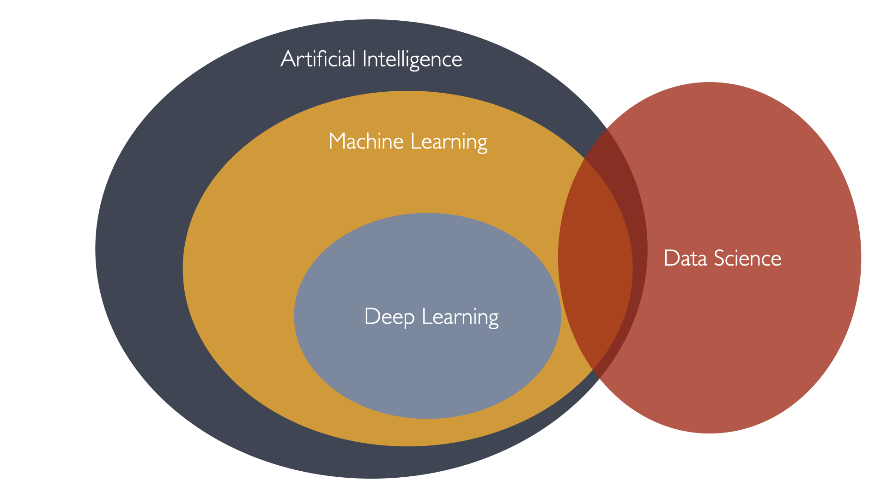
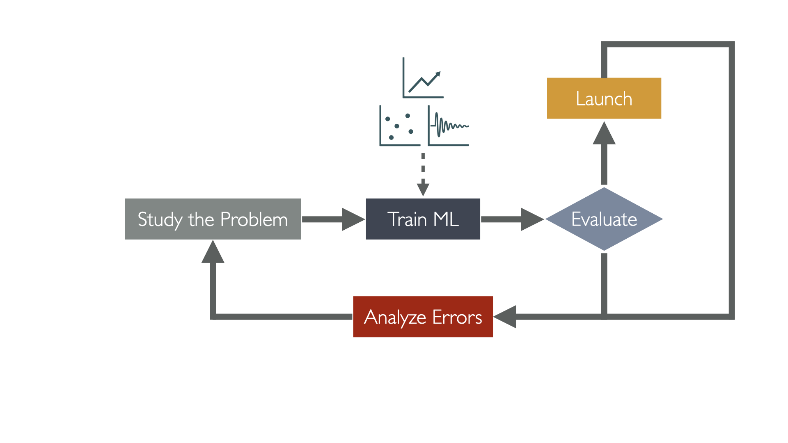
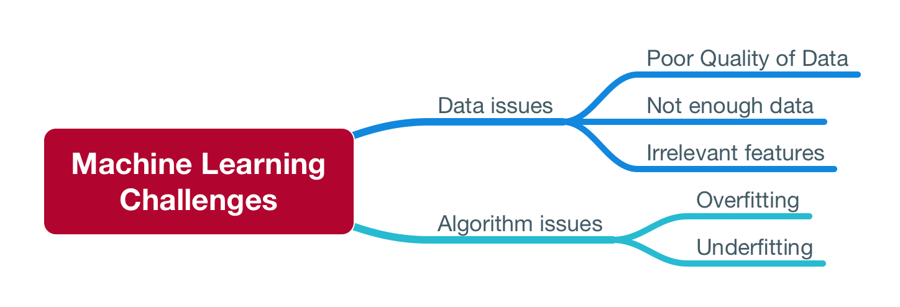

## What is Machine Learning (ML)?
Machine learning is the science of getting computers to act without being explicitly programmed to do so. It brings together the fields of statistics, algebra , and computer science to build algorithms that can learn from data.

Also, 

> A computer program is said to learn from Experience E with respect to some class of tasks T and performance measure P if its performance at tasks in T, as measured by P, improves with experience E.
> 
> _Tom M. Mitchell_

Let's give break this definition down and see what it means.

- **Experience E**: What the machine learns from; The data we feed to the algorithm.
  - It's the datasets that we use to train the algorithm.
- **Tasks T**: What machine learns for; The tasks the algorithm is supposed to perform.
  - image classification, spam email detection, finding patterns in Medical Diagnosis, forecasting stock market prices, ...etc.
- **Performance measure P**: How well the machine learns; The measure of the algorithm's performance and accuracy.
  - Accuracy, Precision, Recall, F1-Score, ...etc.

An Example:

If we take filtering spam emails as an example, we can define the following:
- **Tasks T**: Filtering the spam emails.
- **Experience E**: the labelled emails from users; whether they marked them as spam or not.
- **Performance measure P**: the ratio of emails that are correctly classified as spam or not spam.

- Data Science is a field that uses machine learning to solve problems.
- Not every machine learning is a data science and vice versa.

## When and Why use Machine Learning?
_If we can have the computer teach itself, why do we program anything at all?_

> If the only tool you have is a hammer, you tend to see every problem as a nail.
>
> _The law of Instrument By Abraham Maslow_

- There are 2 factors, based on which we decide if Machine Learning is the right tool for the job:
- The problem's complexity
- and/or the need for adaptivity in the solution you're building

### Tasks that are too complex to program
* **Tasks performed by animals or humans**.
  * our introspection of those tasks is not elaborate enough to extract a defined algorithm that we can program.
    * Speech recognition, understanding images and objects and shapes, and driving cars, playing chess. 
    * There's a lot of mental work that would be near impossible to program.

Another class of tasks that are too complex to program are tasks that are beyond the human capability.
* **Tasks Beyond Human Capability**: 
  * For example, analyzing very large and very complex data sets, finding patterns in millions of correlated records.

### Tasks that require adaptivity
- Programmed solutions are rigid
- Machine learning algorithms are flexible, they can change and adapt to new data, and new experiences.

## Applications of ML
- Analyzing images of products on a production line to detect defects and classify them automatically.
- Detecting tumors in brain scans or body scans, if you know the markers you look for.
- Creating a recommendation system for a website, to recommend products to users based on their previous purchases.
- Or letting the computer learn similarities and cluster similar data point together which may and has been used to identify new patterns and clusters of data that we didn't know existed.
- Segmenting customers based on their purchasing patterns, to create targeted marketing campaigns (clustering).
- Finding new patterns in the tumor scans that led to discovering new markers for cancer.
- Forecasting and optimizing a company revenue, based on historical data (time series analysis).
- ...etc.

## Types of ML Systems:

Three are different ways to classify machine learning systems, or to distinguish between them, like:
- Whether or not they are trained with human supervision (supervised, unsupervised, semisupervised, and reinforcement learning).
- weather or not they can learn incrementally on the fly (online versus batch learning).
- weather or not they work by simply comparing new data points to known data points, or instead detect patterns in the training data and build a predictive model, much like humans do (instance-based versus model-based learning).

### Classification by Supervision Type
#### Supervised Learning
task of learning a function that maps an input to an output based on example input-output pairs. It infers a function from labeled training data consisting of a set of training examples.
  - **Classification**: predicting a categorical label (spam or not spam).
  - **Regression**: predicting a continuous value (price of a house).

#### Unsupervised Learning
Unsupervised learning is a type of algorithm that learns patterns from untagged data. 
  - **Clustering**: grouping similar data points together.

#### Semi-supervised Learning
a hybrid of supervised and unsupervised learning. It combines a small amount of labeled data with a large amount of unlabeled data during training.

#### Reinforcement Learning
Reinforcement learning is an area of machine learning concerned with how intelligent agents ought to take actions in an environment in order to maximize the notion of cumulative reward.

## Challenges of ML
There are challenges related to the data, and challenges related to the algorithms.

### Algorithm Challenges
#### Overfitting the Training Data
Overfitting is when the machine learning model is trained to fit exactly the training data including the noise in the data.
- Overfitting could also occur when you have a lot of features in your data, and you don't have a lot of data to be able to train your model to detect all the patterns and relationships between the different features and come up with a generalized state.
- Overfitting could also happen when you have a lot of features, but you don't have enough data for the model to learn the connections between the features and the target.

Comic: 

#### Underfitting the Training Data
Underfitting is when the model you're developing is not complex enough to fit the complexity in the data.
- This can also be caused by lack of data or features, 
- It can be caused by biased data.
- It can be caused by an overly simple model.

The higher the degree of the polynomial, the more complex the model is, and the more fluctuations that can be controlled.

### Data Challenges
#### Irrelevant Features and Poor quality Data
- Garbage In, Garbage out. 
- If you feed the algorithm with irrelevant features, it will learn irrelevant patterns and will not be able to generalize well.

- there's a process in Machine Learning called feature engineering.

#### Insufficient Quantity of Training Data
- If you don't have enough data, you won't be able to train your model well.
- The most important task a machine learning algorithm goes through is getting trained on the data. and so the more data you have, the better the algorithm will be.
- The quantity of data is a relative, and it depends on the complexity of the problem you're trying to solve.
- The more complex the problem, the more features you have in your data, the more data you need.

- Research shows that even with poor algorithms and models, you can get good results if you have enough data.
  - [Research 1: Scaling to very very large corpora for natural language disambiguation](https://homl.info/6)
  - [Research 2: The Unreasonable Effectiveness of Data](https://homl.info/7)
