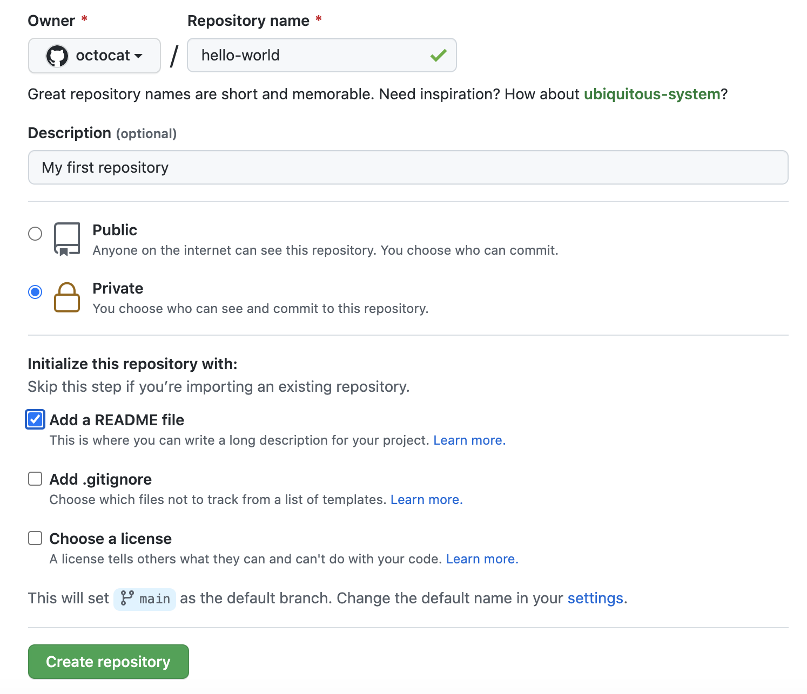
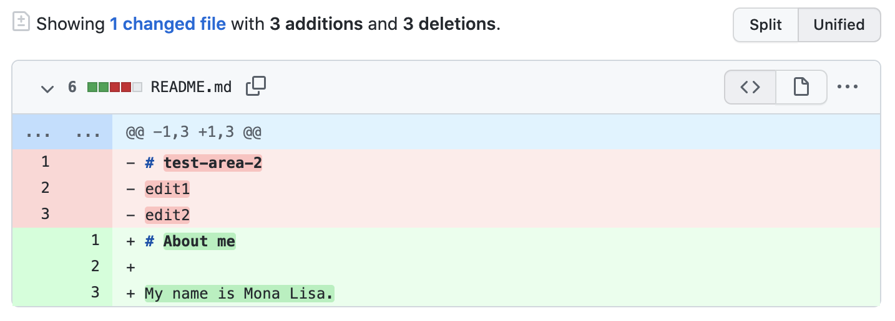

## Creating a repository

A repository is usually used to organize a single project. Repositories can contain folders and files, images, videos, spreadsheets, and data sets -- anything your project needs. Often, repositories include a `README` file, a file with information about your project. GitHub makes it easy to add one at the same time you create your new repository. It also offers other common options such as a license file (we don't need to worry about those for now).

Your `hello-world` repository can be a place where you store ideas, resources, or even share and discuss things with others.

1. In the upper-right corner of any page, use the <Icon>add</Icon> drop-down menu, and select **New repository**.
   
   
2. In the **Repository name** box, enter `hello-world`.
3. In the **Description** box, write a short description.
4. Select **Add a README file**.
5. Click **Create repository**.

   

## Clone down the repository
Now that you have a *remote* repository, we need to clone the repository to create a local repository/instance on your computer.
You can either use GitHub Desktop, Command Line, or Visual Studio Code directly.

<Tabs groupId="method">
   <TabItem value="git-desktop" label="GitHub Desktop" default>
      <ol>
         <li>
            In the File menu, click Clone Repository.  
            
         </li>
         <li>
            Click the tab that corresponds to the location of the repository you want to clone. You can also click URL to manually enter the repository location.  
            
         </li>
         <li>
            Choose the repository you want to clone from the list.  
            
         </li>
         <li>
            Click <strong>Choose...</strong> and navigate to a local path where you want to clone the repository.  
            
         </li>
         <li>
            Click <strong>Clone</strong>.
         </li>
      </ol>
   </TabItem>
   <TabItem value="cli" label="Command Line">
      This is covered in this video - until I type up the instructions. (The video will start at the correct time.)
       
      <iframe width="560" height="315" src="https://www.youtube.com/embed/tCYSYvLHiLE?start=124" title="YouTube video player" frameBorder="0" allow="accelerometer; autoplay; clipboard-write; encrypted-media; gyroscope; picture-in-picture" allowFullScreen></iframe>
   </TabItem>
   <TabItem value="vscode" label="VS Code">
      This is covered in this video - until I type up the instructions. (The video will start at the correct time.)
       
      <iframe width="560" height="315" src="https://www.youtube.com/embed/tCYSYvLHiLE?start=303" title="YouTube video player" frameBorder="0" allow="accelerometer; autoplay; clipboard-write; encrypted-media; gyroscope; picture-in-picture" allowFullScreen></iframe>
   </TabItem>
</Tabs>

## Branching

Branching lets you have different versions of a repository at one time.

By default, your repository has one branch named `main` that is considered to be the definitive branch. You can use branches to experiment and make edits before committing them to `main`.

When you create a branch off the `main` branch, you're making a copy, or snapshot, of `main` as it was at that point in time. If someone else made changes to the `main` branch while you were working on your branch, you could pull in those updates.

This diagram shows:

* The `main` branch
* A new branch called `feature`
* The journey that `feature` takes before it's merged into `main`

Have you ever saved different versions of a file? Something like:

* `story.txt`
* `story-joe-edit.txt`
* `story-joe-edit-reviewed.txt`

Branches accomplish similar goals in GitHub repositories.

Developers use branches for keeping bug fixes and feature work separate from our `main` (production) branch. When a change is ready, they merge their branch into `main`.

### Create a branch

<Tabs groupId="method">
   <TabItem value="git-desktop" label="GitHub Desktop">
      <ol>
         <li>
            At the top of the app, click  Current Branch and then in the list of branches, click the branch that you want to base your new branch on.  
            
         </li>
         <li>
            Click <strong>New Branch.</strong>  
            
         </li>
         <li>
            Under <strong>Name</strong>, type the name of the new branch. <strong>Name the branch <code>readme-edits</code></strong>  
            
         </li>
         <li>
            Use the drop-down to choose a base branch for your new branch.  
            
         </li>
         <li>
            Click <strong>Create Branch.</strong>  
            
         </li>
      </ol>
   </TabItem>
   <TabItem value="cli" label="Command Line">
      <ol>
         <li>
            in the command line terminal, navigate to the repository directory. For example, if the my directory is <code>/Users/joe/hello-world</code>, 
            then type to <code>cd /Users/joe/hello-world</code>.
         </li>
         <li>
            type <code>git branch</code> to see a list of branches.
         </li>
         <li>
            type <code>git branch readme-edits</code> to create a new branch called <code>readme-edits</code>.
         </li>
         <li>
            type <code>git checkout readme-edits</code> to switch to the new branch.
            <ul>
               <li>
                  You could combine the last 2 commands into a single one by typing <code>git checkout -b readme-edits</code>.
               </li>
            </ul>
         </li>
         <li>
            type <code>git checkout main</code> to switch back to the main branch.
         </li>
         {/* <li>
            type <code>git merge readme-edits</code> to merge the new branch into the main branch.
         </li> */}
      </ol>
   </TabItem>
   <TabItem value="vscode" label="Visual Studio Code">
      

         You can create and checkout branches directly within VS code through the <strong>Git: Create Branch</strong> command
         in the Command Palette (⇧⌘P).
      

      

         The <strong>Git: Create Branch</strong> command lets you quickly create a new branch. Just provide the name 
         of your new branch and VS Code will create the branch and switch to it.
      

      
   </TabItem>
   <TabItem value="browser" label="GitHub on Browser">
      <ol>
         <li>Click the <strong>code</strong> tab of your <code>hello-world</code> repository.</li>
         <li>
            Click the drop down at the top of the file list that says **main**.
             
            
         </li>
         <li>Type a branch name, <code>readme-edits</code>, into the text box.</li>
         <li>
            Click <strong>Create branch: readme-edits from main</strong>.
             
            
         </li>
      </ol>
   </TabItem>
</Tabs>

Now you have two branches, `main` and `readme-edits`. Right now, they look exactly the same. Next you'll add changes to the new branch.

## Making and committing changes
* Make sure you've navigated to the correct branch (readme edits).

* You can make and save changes to the files in your repository. In Git, saved changes are called commits. Each commit has an associated commit message, which is a description explaining why a particular change was made. Commit messages capture the history of your changes so that other contributors can understand what you've done and why.

<Tabs groupId="method">
   <TabItem value="" label="GitHub Desktop">
      <ol>
         <li>
            After you make your edits to the readme.md file locally in your favourite text editor, go to your command line terminal
         </li>
         <li>
            At the bottom of the list of changes, in the Summary field, type a short, meaningful commit message. Optionally, you can add more information about the change in the Description field.  
            
         </li>
         <li>
            Under the Description field, click <strong>Commit to <i>readme-edits</i></strong>. 
            
         </li>
         <li>
            Click Push origin to push your local changes to the remote repository. 
            
         </li>
      </ol>
   </TabItem>
   <TabItem value="cli" label="Command Line">
      <ol>
         <li>
            type <code>git add .</code> to add all of the files in your repository to the commit.
         </li>
         <li>
            type <code>git commit -m "edited readme file"</code> to save your changes.
         </li>
         <li>
            type <code>git push origin main</code> to push your changes to the remote main branch.
         </li>
      </ol>
   </TabItem>
   <TabItem value="vscode" label="Visual Studio Code">
      <a href="https://code.visualstudio.com/docs/editor/versioncontrol#_commit">Find Instructions on VSCode Documentation page</a>
   </TabItem>
   <TabItem value="browser" label="GitHub on Browser">
      <ol>
         <li>Click the `README.md` file.</li>
         <li>Click <Icon>edit</Icon> to edit the file.</li>
         <li>In the editor, write a bit about yourself.</li>
         <li>Copy and Paste the <a href="#checklist">assignment checklist</a></li>
         <li>In the <strong>Commit changes</strong> box, write a commit message that describes your changes.</li>
         <li>Click <strong>Commit changes</strong>.</li>
      </ol>
      
   </TabItem>
</Tabs>

These changes will be made only to the README file on your `readme-edits` branch, so now this branch contains content that's different from `main`.

## Opening a pull request

Now that you have changes in a branch off of `main`, you can open a pull request.

Pull requests are the heart of collaboration on GitHub. When you open a pull request, you're proposing your changes and requesting that someone review and pull in your contribution and merge them into their branch. Pull requests show diffs, or differences, of the content from both branches. The changes, additions, and subtractions are shown in different colors.

As soon as you make a commit, you can open a pull request and start a discussion, even before the code is finished.

By using GitHub's `@mention` feature in your pull request message, you can ask for feedback from specific people or teams, whether they're down the hall or 10 time zones away.

You can even open pull requests in your own repository and merge them yourself. It's a great way to learn the GitHub flow before working on larger projects.

1. Click the **Pull requests** tab of your `hello-world` repository.
2. Click **New pull request**
3. In the **Example Comparisons** box, select the branch you made, `readme-edits`, to compare with `main` (the original).
4. Look over your changes in the diffs on the Compare page, make sure they're what you want to submit.

   

5. Click **Create pull request**.
6. Give your pull request a title and write a brief description of your changes. You can include emojis and drag and drop images and gifs.
7. Click **Create pull request**.

Your collaborators can now review your edits and make suggestions.

## Merging your pull request

In this final step, you will merge your `readme-edits` branch into the `main` branch.

1. Click **Merge pull request** to merge the changes into `main`.
2. Click **Confirm merge**.
3. Go ahead and delete the branch, since its changes have been incorporated, by clicking **Delete branch**.
