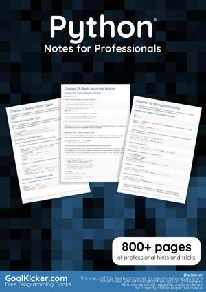
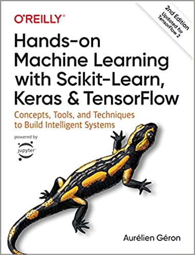

* 
* [Computational and Inferential Thinking: The Foundations of Data Science](https://inferentialthinking.com/chapters/intro.html)
* [Principles and Techniques of Data Science](https://www.textbook.ds100.org/intro.html)
* [Python Tutorial - Official Documentation](https://docs.python.org/3/tutorial/)
* Available on O'Reilly Media
  * 
  * [Practical Statistics for Data Scientists](http://uclid.uc.edu/record=b8346984~S39)

## Looks promising but Not Vetted
* https://automatetheboringstuff.com/

## Other Resources
* [TidyTuesday](https://github.com/rfordatascience/tidytuesday/tree/2e9bd5a67e09b14d01f616b00f7f7e0931515d24/data/2020)
  * A weekly data project aimed at the R ecosystem. As this project was borne out of the R4DS Online Learning Community and the R for Data Science textbook, an emphasis was placed on understanding how to summarize and arrange data to make meaningful charts with ggplot2, tidyr, dplyr, and other tools in the tidyverse ecosystem. However, any code-based methodology is welcome - just please remember to share the code used to generate the results.
  * while this is in R and the course is in Python, the concepts are the same and the data sets are interesting to work on. For example, [this repo](https://github.com/machow/tidytuesday-py) uses the data from TidyTuesday in Python. You can do the same.

* [Computational and Inferential Thinking: The Foundations of Data Science](https://inferentialthinking.com/chapters/intro.html)
*[FiveThirtyEight](https://fivethirtyeight.com)
  * [FiveThirtyEight on GitHub](https://github.com/fivethirtyeight)